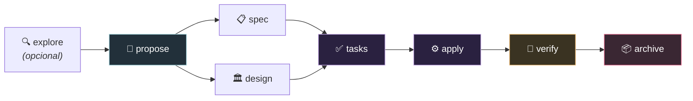
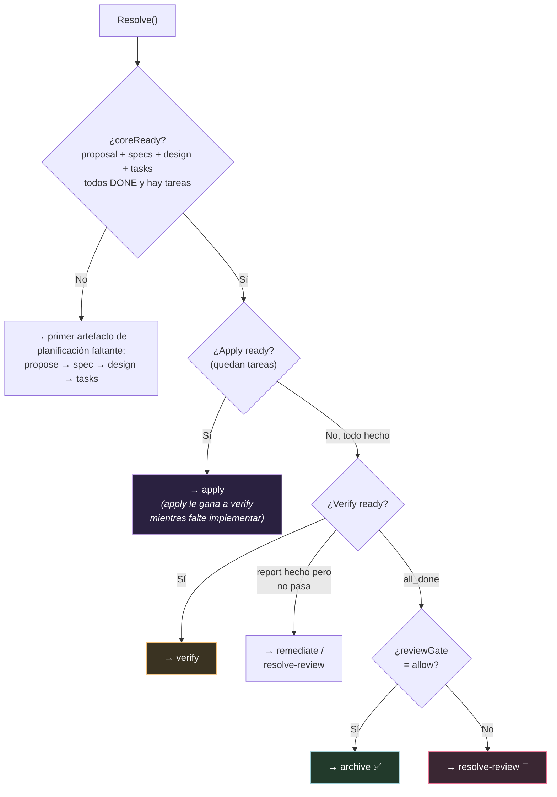
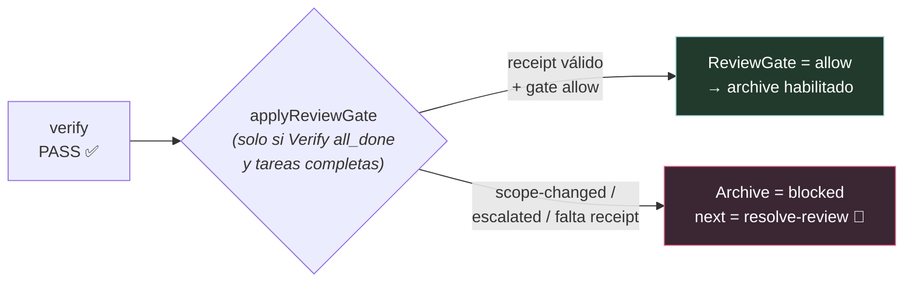
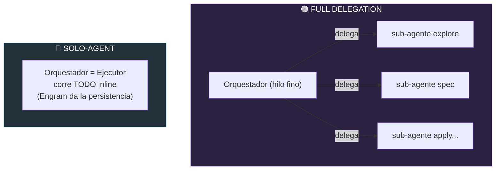
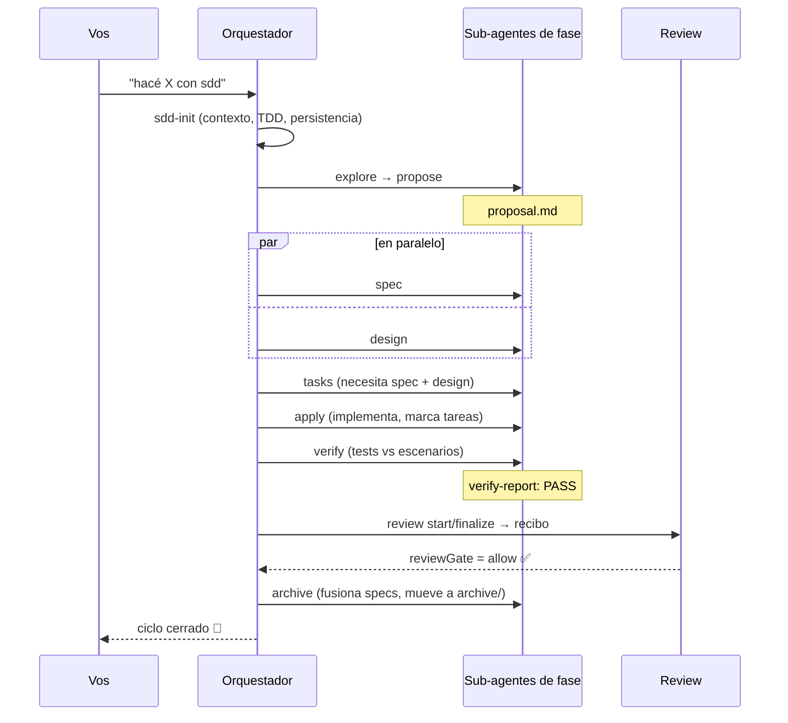

# SDD (Spec-Driven Development) de Gentle-AI, para dummies 📐

> Qué es el método SDD, sus fases, qué produce cada una, cómo decide el próximo
> paso y cómo se conecta con el review. Punto por punto, coma por coma, en criollo.
> Verificado contra `internal/sddstatus/`, `internal/components/sdd/`,
> `internal/assets/skills/sdd-*/` y `docs/`.

---

## 0. ¿Qué es SDD? (la idea en una frase)

> **SDD = ponerse de acuerdo en el QUÉ antes de escribir el CÓMO.**

Es el método de trabajo que Gentle-AI le inyecta al agente para cambios serios.
En vez de que la IA se ponga a tirar código de una (y después te des cuenta de que
hizo cualquier cosa), SDD la obliga a pasar por fases: primero explorar, proponer,
especificar y diseñar; recién ahí implementar; después verificar y archivar.

**Analogía de obra 🏗️:** no empezás a levantar paredes sin planos aprobados. Primero
el anteproyecto (proposal), después los planos con medidas exactas (spec), la ingeniería
(design), la lista de tareas del capataz (tasks), la construcción (apply), la inspección
(verify) y la entrega de la obra con los planos actualizados (archive).

**¿Cuándo se usa?** Vos NO tenés que aprender las fases — el agente las corre.
- Cambio chico → el agente lo hace y listo.
- Feature, API, decisión de arquitectura → el agente sugiere SDD.
- Vos podés forzarlo: *"hacelo con sdd"* / *"use sdd"*.

---

## 1. Las fases y su orden (la cadena de dependencias)

La cadena canónica *(`sdd-orchestrator-workflow.md:108`, enum Go `status.go:60`)*:



**Clave:** `spec` y `design` corren **en paralelo** (ambos dependen solo de `proposal`).
`tasks` necesita a los DOS. El orden es:

```
proposal → [spec ∥ design] → tasks → apply → verify → archive
```

---

## 2. Qué hace cada fase, qué lee y qué escribe

Cada fase es una skill (`internal/assets/skills/sdd-*/SKILL.md`). Todas tienen la misma
estructura de guarda: un **ORCHESTRATOR GATE** (si sos el orquestador, delegá, no ejecutes)
y un **Executor Override** (si sos el sub-agente, ejecutá).

| Fase | Lee | Escribe | Para qué |
|------|-----|---------|----------|
| **sdd-init** | archivos del proyecto | contexto, `.atl/skill-registry.md`, capacidades de test | Detecta stack, convenciones, tooling de tests, resuelve Strict TDD, arranca la persistencia. **No** está en la cadena de artefactos. |
| **sdd-explore** | nada | `exploration.md` (opcional) | Investiga el código, compara enfoques, recomienda. Solo lectura salvo el opcional. |
| **sdd-propose** | exploration (opcional) | `proposal.md` | Intención, scope (in/out), **Capabilities** (contrato con spec), enfoque, riesgos, rollback, criterios de éxito. <450 palabras. |
| **sdd-spec** | proposal (requerido) | `specs/{dominio}/spec.md` (delta) | Requisitos ADDED/MODIFIED/REMOVED/RENAMED con escenarios Given/When/Then + palabras RFC 2119 (MUST/SHOULD...). <650 palabras. |
| **sdd-design** | proposal (req), spec (opcional) | `design.md` | Enfoque técnico, decisiones de arquitectura + rationale, flujo de datos, cambios de archivos, interfaces, estrategia de tests, matriz de amenazas. <800 palabras. |
| **sdd-tasks** | spec + design (requeridos) | `tasks.md` | Tareas accionables, numeradas jerárquicamente, por fases + **Review Workload Forecast** (guarda del presupuesto de 400 líneas, recomienda chained-PR). <530 palabras. |
| **sdd-apply** | tasks + spec + design + apply-progress | `apply-progress.md`; marca `[x]` en tasks | Implementa las tareas siguiendo specs/design al pie de la letra. Gate de Strict-TDD + gate de evidencia por work-unit. |
| **sdd-verify** | spec + tasks + apply-progress | `verify-report.md` | Puerta de calidad: corre tests, mapea CADA escenario de spec a un test que pasa. Resultado: PASS / PASS WITH WARNINGS / FAIL. Solo corre cuando todas las tareas están completas. |
| **sdd-archive** | TODOS los artefactos + verify-report + review | `archive-report`; fusiona deltas en `openspec/specs/`; mueve la carpeta a `archive/` | Cierra el ciclo. **Requiere `reviewGate.result: allow`**; bloquea si hay issues CRITICAL o tareas sin marcar. |
| **sdd-onboard** | escanea el código | todos los artefactos (cambio real) | Walkthrough interactivo "enseñar haciendo" del ciclo completo, corre INLINE. |

**Meta-comandos del orquestador** (rutean, no hacen trabajo de fase):
- **sdd-init** — inicializa contexto. MANDATORIO antes de cualquier trabajo SDD.
- **sdd-new `<cambio>`** — corre `explore` y después `propose`.
- **sdd-ff `<nombre>`** — fast-forward de las 4 fases de planificación (`propose → spec → design → tasks`).
- **sdd-continue `[cambio]`** — corre la próxima fase lista según las dependencias.
- **sdd-status `[cambio]`** — estado estructurado, solo lectura, nunca lanza ejecutores.

---

## 3. Dónde vive todo en el disco (OpenSpec)

Estructura canónica *(`openspec-convention.md:5`)*:

```
openspec/
├── config.yaml                      ← config SDD del proyecto (schema, contexto, reglas, testing)
├── specs/                           ← 📖 LA FUENTE DE VERDAD (specs principales)
│   └── {dominio}/spec.md
└── changes/
    ├── archive/                     ← cambios completos: AAAA-MM-DD-{nombre}/
    └── {nombre-del-cambio}/         ← cambio activo
        ├── state.yaml               ← estado del DAG (sobrevive compactación)
        ├── exploration.md           ← sdd-explore (opcional)
        ├── proposal.md              ← sdd-propose
        ├── specs/{dominio}/spec.md  ← sdd-spec (specs DELTA)
        ├── design.md                ← sdd-design
        ├── tasks.md                 ← sdd-tasks (lo actualiza sdd-apply)
        ├── apply-progress.md        ← sdd-apply
        ├── verify-report.md         ← sdd-verify
        ├── review-ledger.md         ← sistema de review
        └── reviews/                 ← artefactos de review
```

**El truco clave del archive:** los cambios activos tienen specs **delta** (solo lo que
cambia). Al archivar, esos deltas se **fusionan** en `openspec/specs/` (la fuente de verdad
que va creciendo), y la carpeta del cambio se mueve a `archive/` con fecha adelante.

---

## 4. Cómo se calcula el "próximo paso" (`status.go` → `Resolve`)

Esta es la parte que decide, en cada momento, qué fase te toca. `Resolve` mira el estado
de cada artefacto y calcula dependencias.

**Los enums que importan:**
- **ArtifactState:** `missing`, `partial`, `done`.
- **DependencyState / ApplyState:** `blocked`, `ready`, `all_done`.
- **ArtifactStore:** `openspec`, `engram`, `none`.

**El pipeline de decisión:**



**El orden de prioridad de `nextRecommended`** (`status.go:1312`):
1. `apply` si Apply está ready (implementar le gana a verificar mientras falte código).
2. `verify` si Verify está ready.
3. Si apply terminó y hay report pero Verify no está all_done → `remediate` (si hace falta) o `resolve-review`.
4. `archive` si Verify all_done + apply all_done + **reviewGate allow**.
5. Si no, el primer artefacto de planificación faltante: `propose → spec → design → tasks`.
6. Fallback `resolve-blockers` (anomalía real).

> **Regla importante:** `Verify` solo llega a `all_done` cuando el report existe, coreReady,
> **todas** las tareas completas Y el report **pasa**. Y `Archive` solo está ready cuando
> `Verify == all_done` y todas las tareas completas.

---

## 5. Cómo se conecta SDD con el sistema de Review 🔗

Este es el puente entre los dos mundos. **El review NO bloquea `verify` — bloquea `archive`.**



**Cómo funciona `applyReviewGate`** (`review_gate.go:228`):
- Solo actúa cuando `Verify == all_done` **y** todas las tareas completas (o sea, el review es la puerta del **archive**, no del verify).
- Carga el recibo de review, lo parsea, y evalúa un gate `post-apply` nativo (`EvaluateCompactGate`).
- `allow` → `ReviewGate = allow`, deja llegar a `archive`.
- `scope-changed` / `escalated` / cualquier otra → bloquea `archive`, pone `next = resolve-review`.

**El comando `bind-sdd`** (`review bind-sdd`): ata explícitamente un linaje de review
**approved** a un cambio de OpenSpec. Requiere `--cwd --change --lineage --expected-binding-revision`.
`BindApprovedReview` (`review_binding.go:37`):
1. Valida el nombre del cambio (kebab-case).
2. Carga el store del linaje; **exige que esté `StateApproved`**.
3. Verifica que el recibo en disco sea **exactamente igual** al autoritativo.
4. Evalúa el gate post-apply; exige `allow`.
5. Construye un `ReviewBinding` (schema `gentle-ai.sdd-review-binding/v1`).
6. **Re-lee todo (doble chequeo TOCTOU)** y falla si algo cambió antes de publicar.
7. Escribe el binding con CAS contra la revisión esperada.

**En resumen:** un recibo de review approved+matcheante (o un binding explícito) es un
**prerrequisito duro para archivar**. Verify es el chequeo independiente de requisitos/runtime;
el review gate es el chequeo de autoridad humana, encima, antes de cerrar el ciclo.

---

## 6. Cómo se le entrega SDD a cada agente (`internal/components/sdd/`)

Gentle-AI **genera código por agente** desde los assets embebidos. Piezas clave:
- **`inject.go`** (100KB) — el inyector principal. Escribe el workflow del orquestador,
  los comandos SDD, los archivos de agentes de fase, las trigger rules, y (para OpenCode)
  inlinea prompts en `opencode.json`. Fuerza los "delegation hard gates" (regla de 4 archivos,
  regla de multi-file write, regla de PR, regla de sesión larga).
- **`prompts.go`** — escribe los 10 prompts de sub-agentes a `~/.config/opencode/prompts/sdd/{fase}.md`.
  Extrae la sección de modelo (variantes "capable" vs "small") de cada `SKILL.md`.
- **`profiles.go`** — perfiles SDD de OpenCode. Lista canónica de 10 fases.
- **`commands.go`**, **`triggerrules.go`**, **`boundedreview.go`** — comandos, reglas de trigger, contrato de review.

### Full-delegation vs Solo-agent

Esta es LA distinción de cómo corre SDD según el agente *(`docs/agents.md:36`)*:



| Modelo | Cómo funciona | Agentes |
|--------|---------------|---------|
| **Full (sub-agentes)** | Cada fase corre en su propio contexto aislado vía delegación nativa. El orquestador coordina, los sub-agentes ejecutan. | Claude Code, OpenCode, Kilo, Gemini, Cursor, VS Code Copilot, Kimi, Kiro, Qwen, Pi |
| **Full (delegate_task)** | Hermes spawnea workers efímeros de contexto fresco; el padre recibe solo el resumen. | Hermes |
| **Solo-agent** | Todas las fases corren **inline en la misma conversación**; el orquestador ES el ejecutor; Engram da la persistencia entre fases. | Codex, Windsurf, Antigravity, OpenClaw, Trae |

Por eso cada `SKILL.md` tiene el par ORCHESTRATOR GATE + Executor Override: en full-delegation
el gate dispara y el orquestador delega a un sub-agente real; en solo-agent el orquestador
corre la fase inline. Los modelos por fase (solo full-delegation): explore/spec/tasks/apply/verify
→ sonnet; propose/design → opus; archive → haiku.

---

## 7. Los backends de persistencia (dónde se guardan los artefactos)

Se resuelve UNA vez por sesión y se pasa a cada fase *(`persistence-contract.md`)*:

| Modo | Lee de | Escribe a | ¿Archivos en el repo? | ¿Sobrevive compactación? | ¿Compartible en equipo? | ¿Historial? |
|------|--------|-----------|:-:|:-:|:-:|:-:|
| **engram** | Engram | Engram | ❌ | ✅ | ❌ (DB local) | ❌ (upsert pisa) |
| **openspec** | filesystem | filesystem | ✅ | ❌ (necesita git) | ✅ (commits) | ✅ (git) |
| **hybrid** | Engram + fallback FS | ambos | ✅ | ✅ | ✅ | ✅ |
| **none** | contexto del prompt | ningún lado | ❌ | ❌ | ❌ | ❌ |

- **engram** — memoria de trabajo entre sesiones; upserts por `topic_key` (re-correr una fase
  pisa, sin historial); solo local. **Default cuando Engram está disponible.**
- **openspec** — la fuente de verdad; archivos reales con auditoría git; compartible.
- **hybrid** — persiste a los DOS (Engram para recuperación, OpenSpec para archivos versionados);
  más caro en tokens; lee Engram primero con fallback a filesystem.
- **none** — efímero, inline, se pierde al cerrar la conversación.

> Ojo: el dispatcher nativo (`gentle-ai sdd-continue` / `sdd-status`) solo lee OpenSpec y
> siempre reporta `artifactStore: openspec`. En modo `engram`, el orquestador NO llama al
> binario y resuelve el estado desde los topic keys de Engram.

---

## 8. El ciclo completo, de punta a punta



---

## Glosario del SDD

- **SDD:** Spec-Driven Development. Acordar el QUÉ antes del CÓMO.
- **Fase:** una etapa del ciclo (explore, propose, spec, design, tasks, apply, verify, archive).
- **Proposal:** el anteproyecto (intención, scope, riesgos).
- **Spec:** los requisitos formales con escenarios Given/When/Then.
- **Design:** el enfoque técnico y las decisiones de arquitectura.
- **Tasks:** la lista accionable de trabajo.
- **Apply:** la implementación.
- **Verify:** la puerta de calidad (tests vs specs).
- **Archive:** el cierre (fusiona deltas en la fuente de verdad).
- **Delta spec:** solo lo que cambia (se fusiona al archivar).
- **coreReady:** proposal + specs + design + tasks, todos done.
- **Orchestrator gate / Executor override:** el mecanismo que hace que en full-delegation se delegue y en solo-agent se corra inline.
- **reviewGate:** la puerta de autoridad de review que habilita el archive.
- **Persistencia (engram/openspec/hybrid/none):** dónde se guardan los artefactos.

---

*Fuentes: `internal/sddstatus/status.go`, `review_gate.go`, `review_binding.go`,
`internal/components/sdd/*.go`, `internal/assets/skills/sdd-*/SKILL.md`,
`internal/assets/claude/sdd-orchestrator-workflow.md`, `docs/intended-usage.md`,
`docs/agents.md`. Verificado contra el código.*
