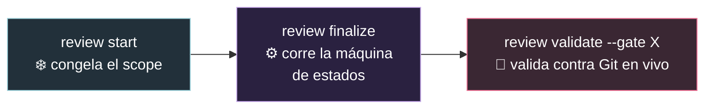
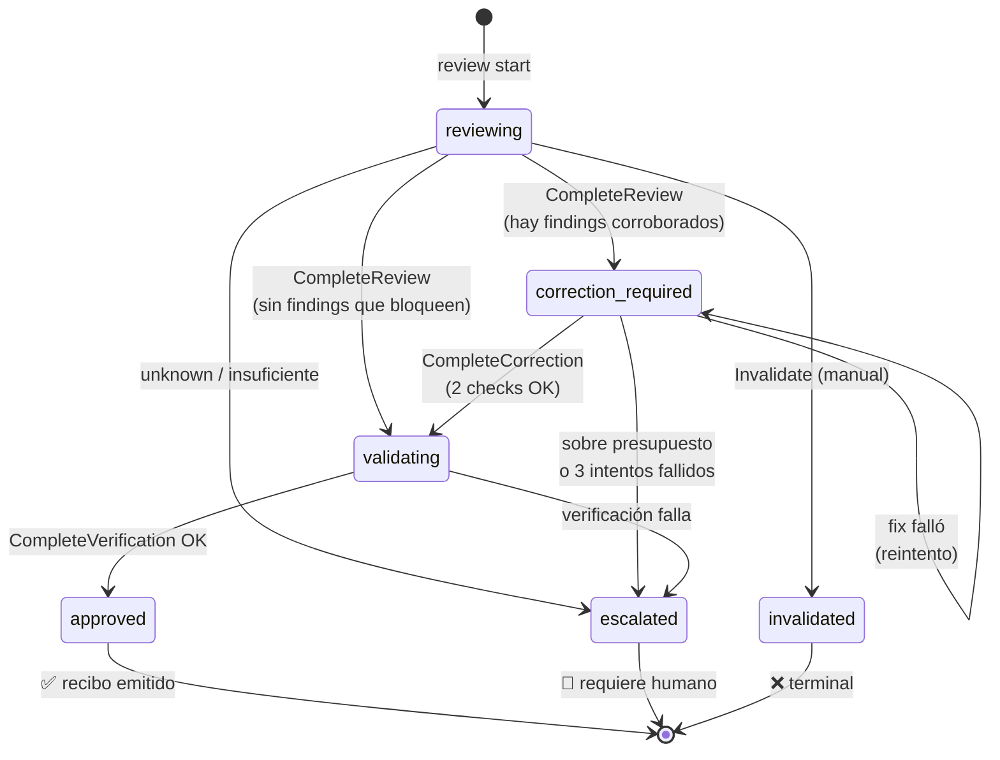
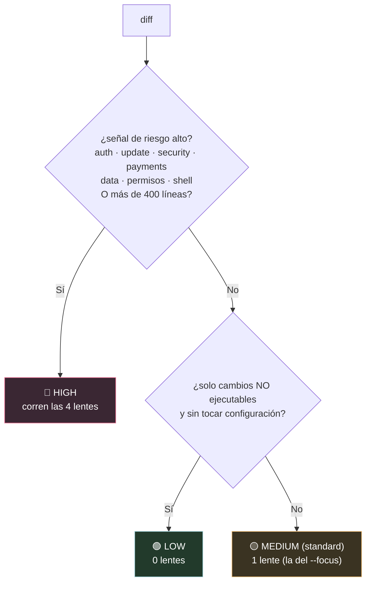
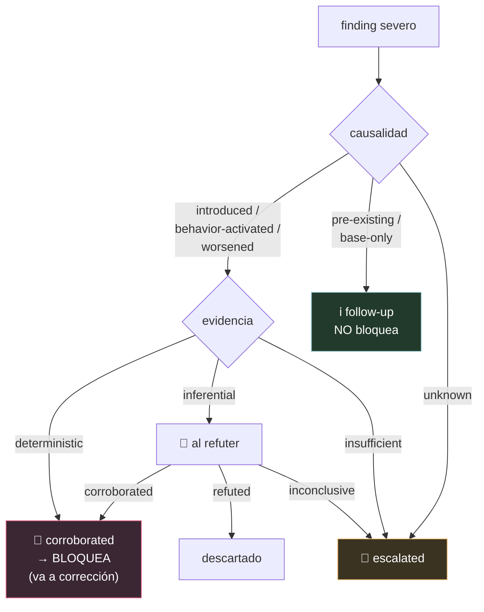
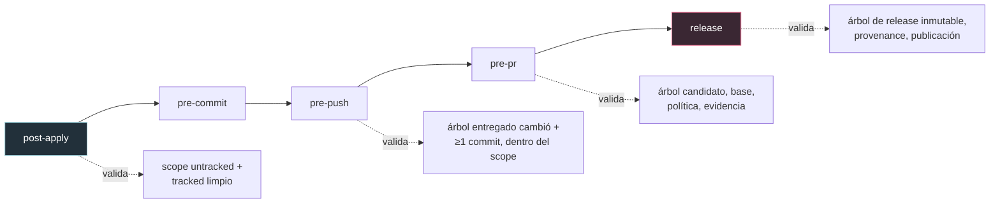
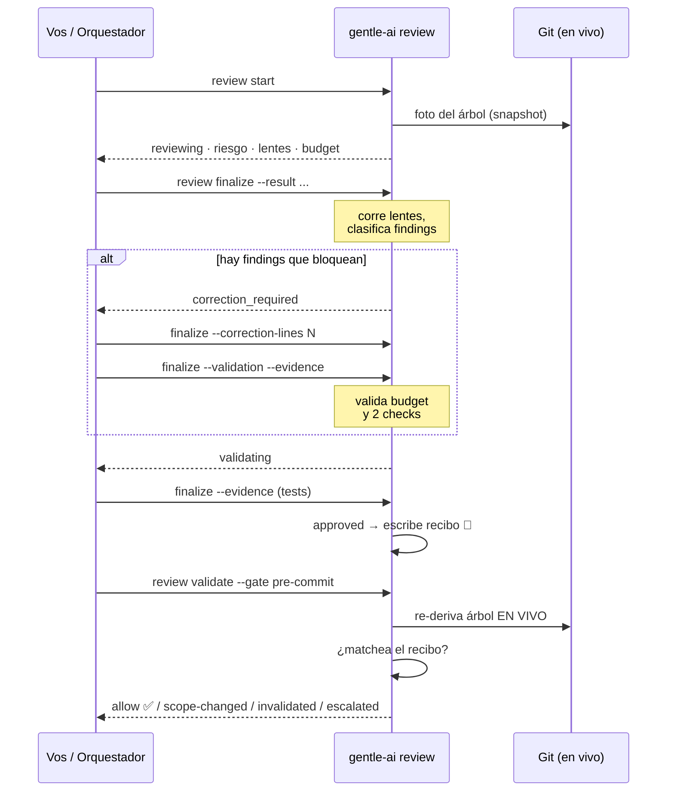

# El sistema de Review de Gentle-AI, explicado para dummies 🔍

> Todo lo que hace el sistema de revisión acotada (bounded native review),
> punto por punto, coma por coma, pero en criollo. Verificado contra el código
> en `internal/reviewtransaction/` y `internal/cli/review*.go`.

---

## 0. ¿Qué problema resuelve? (leé esto primero)

Cuando un agente de IA te dice *"revisé el código y está todo bien"*, ¿por qué le
creerías? No podés. La IA **narra**, y la narración no es prueba.

El sistema de review de Gentle-AI existe para una sola cosa:

> **Confiar en lo que se puede DERIVAR de Git de forma determinística, no en lo que un agente te cuenta.**

La idea central, si te llevás UNA sola cosa de este documento:

- Cuando la revisión termina bien, se emite un **recibo** (`receipt`).
- Ese recibo está **atado por hash al árbol exacto de Git** que se revisó.
- Cada vez que querés hacer algo serio (commit, push, PR, release), un **gate**
  (una barrera) vuelve a mirar Git EN VIVO y compara: *"¿lo que estoy por entregar
  es EXACTAMENTE lo que decía el recibo?"*. Si cambió algo, la barrera no te deja pasar.

**Analogía:** el recibo es como el certificado de un escribano sobre un documento.
Si después le cambiás una coma al documento, el certificado ya no vale — y el
sistema se da cuenta al instante, porque compara la huella digital.

⚠️ **Límite honesto (threat model):** esto te protege de accidentes (cambios de
scope, líos de git, escrituras concurrentes). **NO** te protege de un atacante malicioso
con tu mismo usuario y acceso al disco: ese puede reescribir el estado, el recibo, el
repo o el binario. No hay ancla de confianza externa. Es protección contra errores, no
contra sabotaje.

---

## 1. Dos motores conviven (ojo con esto)

Hay dos implementaciones del sistema, y conviene saberlo:

| Motor | Schema | Estado | Quién lo usa |
|-------|--------|--------|--------------|
| **compact-v2** | `gentle-ai.review-state/v2` | **Activo** | Lo que manejan de verdad `review start/finalize/validate`. |
| **legacy-v1** | `gentle-ai.review-transaction/v1` | **Solo lectura** (`ErrLegacyReadOnly`) | Lineages viejos. Define el vocabulario más rico (Judgment Day, refuter completo). |

Todo lo que hace el CLI hoy corre en **compact-v2**, siempre en modo
`ordinary_bounded`. El modo **Judgment Day** y el **refuter** completo viven en el
motor v1 (y en la skill `judgment-day`), no se alcanzan desde `review start/finalize`.

> Detalle fino: el nivel de riesgo que los prompts llaman *"standard"* se llama
> literalmente `medium` / `RiskMedium` en el código (`risk.go:25`).

---

## 2. Las tres operaciones del CLI (el corazón)

Todo pasa por `gentle-ai review <sub>`. Las tres importantes:



### 2.1 `review start` — congelar el scope
*(`RunReviewFacadeStart`, `review_facade.go:329`)*

**Qué hace, paso a paso:**
1. Resuelve la raíz del repo y valida la proyección (`workspace` o `staged`).
2. Si usás `--base-ref` y hay cambios sucios sin commitear, te exige `--committed-only` (que reconozcas que quedan afuera).
3. Descubre los archivos "intended-untracked" (los nuevos que querés incluir), salvo en proyección `staged`.
4. Construye un **snapshot** (una foto inmutable del árbol de Git).
5. **Clasifica el riesgo** y cuenta las líneas cambiadas.
6. **Selecciona las lentes** de revisión según el riesgo (ver §4).
7. Deriva un `lineage_id` (identificador de linaje): `review-<primeros 16 hex de la identidad del snapshot>`.
8. Calcula y **congela el presupuesto de corrección** (ver §6).
9. Crea la autoridad compacta en estado `reviewing`, generación 1, bajo un lock global.

**Flags:** `--cwd`, `--lineage`, `--policy`, `--focus` (default `reliability`), `--base-ref`, `--projection` (default `workspace`), `--committed-only`, `--trace`.

**Salida (JSON):** `operation`, `action` (created/resumed/...), `lenses_required`, `lineage_id`, `state`, `risk_level`, `selected_lenses`, `projection`, `changed_files`, `changed_lines`, `correction_budget`.

- **Precondición:** es un repo Git, no hay un linaje legacy que colisione.
- **Postcondición:** queda persistida una autoridad `reviewing` con el scope congelado, el tier de riesgo, las lentes y el presupuesto.

### 2.2 `review finalize` — correr la máquina de estados
*(`RunReviewFacadeFinalize`, `review_facade.go:427`)*

Esta es la más rica. **Avanza el estado tan lejos como los inputs se lo permitan** en una sola corrida:

1. Descubre la autoridad compacta.
2. Si está en `reviewing`: canoniza los resultados de las lentes, arma las clasificaciones de los findings severos → `CompleteReview`.
3. Si quedó en `correction_required` y pasás `--correction-lines > 0`: `BeginCorrection` (registra el pronóstico).
4. Si falta el pronóstico: te dice *"rerun with --correction-lines before editing"*.
5. Si hay pronóstico pero falta `--validation`: te dice *"aplicá la corrección, después rerun con --validation y --evidence"*.
6. Si aplicaste la corrección: rechaza archivos untracked fuera de scope, construye el snapshot del fix, mide las líneas reales → `CompleteCorrection`.
7. Si está en `validating`: exige `--evidence`, hace `CompleteVerification(evidence, !failed)`.
8. Al llegar a terminal (`approved`/`escalated`): genera el recibo y lo escribe atómicamente.

**Flags:** `--result` (repetible, en orden de lentes), `--validation`, `--refuter`, `--evidence` (archivo o `-` para stdin), `--correction-lines`, `--failed`, `--lineage`, `--trace`.

**Salida (JSON):** `operation`, `lineage_id`, `state`, `action` (texto del próximo paso), `store_revision`, `receipt_path` (solo cuando es terminal).

- **Precondición:** existe una autoridad compacta no-terminal.
- **Postcondición:** el estado avanzó; si llegó a terminal, quedó escrito `review-receipt.json`.

### 2.3 `review validate --gate <gate>` — la barrera
*(`RunReviewFacadeValidate`, `review_facade.go:574`)*

**Qué hace:**
1. Exige `--gate` (`post-apply|pre-commit|pre-push|pre-pr|release`).
2. Descubre la autoridad y lee el recibo.
3. Vuelve a derivar la evidencia **desde Git en vivo** y compara contra el recibo.
4. Emite `allow` / `scope-changed` / `invalidated` / `escalated`.

**Salida (JSON):** `schema`, `result`, `allowed` (bool), `action` (allow→"continue", escalated→"stop", resto→"explicit-maintainer-action"), `reason`, `context`.

- **Precondición:** existe un recibo terminal que matchea la autoridad actual.
- **Postcondición:** **solo lectura**, no muta nada. Devuelve error (exit code ≠ 0) si el resultado no es `allow`.

---

## 3. La máquina de estados (compact-v2)

Estos son TODOS los estados por los que puede pasar una revisión:



**Los tres estados terminales:**
- ✅ `approved` — todo bien, se emite el recibo.
- 🛑 `escalated` — algo necesita intervención humana explícita.
- ❌ `invalidated` — anulado (es de un solo sentido, "deliberadamente sin inversa").

`MaxCompactCorrectionAttempts = 3` (`compact.go:23`): tres intentos de corrección
fallidos **agotan el linaje** y lo mandan a `escalated`, aunque su delta medido sea cero.

---

## 4. Riesgo y lentes: ¿cuánta revisión te toca?
*(`risk.go`)*

El sistema NO revisa todo igual. Primero triagea el diff en un **tier de riesgo**, y el
tier decide **cuántas lentes** corren. Las 4 lentes (las "4R"):

| Lente | Mira... |
|-------|---------|
| `review-risk` | Seguridad, permisos, exposición de datos, dependencias. |
| `review-resilience` | Fallos parciales, reintentos, degradación, observabilidad. |
| `review-readability` | Nombres, estructura, mantenibilidad. |
| `review-reliability` | Comportamiento, tests, determinismo, regresiones. |

**Constantes clave:** `LargeChangeLines = 400`, `MaxCorrectionChangedLines = 200`.

**Los tres tiers** (se evalúa alto → bajo → medio, gana el primero que matchea):



- 🟢 **LOW** → 0 lentes. Solo si `OnlyNonExecutableChanges && !TouchesConfiguration` (docs, comentarios, formato). Cualquier código o config ejecutable ya sube a medium.
- 🟡 **MEDIUM (standard)** → exactamente **1** lente, la que elijas con `--focus`.
- 🔴 **HIGH** → las **4** lentes, si hay señal alta, toca un hot path (`auth|update|security|payments`), o **más de 400 líneas** cambiadas (estrictamente `> 400`).

**Cómo se cuentan las líneas** (`CountChangedLines`): suma `additions + deletions` por
ruta canónica única. Los golden generados, binarios y cambios de solo-modo cuentan **cero**
(pero siguen en la identidad del snapshot).

---

## 5. Findings: cuáles bloquean y cuáles no
*(`transaction.go` / `compact.go`)*

No todo hallazgo (finding) frena tu trabajo. Se clasifican por **causalidad** (¿lo
causó tu cambio?) y por **evidencia** (¿qué tan probado está?).

**Severidad:** `BLOCKER` y `CRITICAL` son "severos"; `WARNING` y `SUGGESTION` no.
Solo los severos pueden ir a corrección.

**Causalidad** — la pregunta clave: *"¿este problema lo trajo TU cambio?"*



**En criollo:**
- **`pre-existing` / `base-only`** (ya estaba antes) → informativo, es un follow-up. **NUNCA bloquea.**
- **`introduced` / `behavior-activated` / `worsened`** (lo trajiste vos) + evidencia **determinística** → **bloquea**, va a corrección.
- Los mismos, pero con evidencia **inferencial** → van al **refuter** (un revisor que intenta refutarlos). Si sobrevive, bloquea; si lo refuta, se descarta.
- **`unknown`** de causalidad o evidencia **insuficiente** → **escala** (necesita humano).

**Refuter (modo ordinario):** los findings inferenciales severos se agrupan en UN solo
batch (cap = 1) y un revisor detached intenta refutarlos. `corroborated`→corrección,
`refuted`→descartado, `inconclusive`→escala.

**Judgment Day (solo motor v1):** en vez de refuter, usa **exactamente 2 jueces ciegos**,
distintos, con pruebas hasheadas y un hash de acuerdo. Bajo Judgment Day, lo inferencial
se toma como corroborado directo. No se alcanza desde el facade compacto — vive en la
skill `judgment-day`.

---

## 6. La corrección acotada (bounded correction)

Cuando hay findings que bloquean, se permite **UNA transacción de corrección**, y está
acotada con un **presupuesto**.

**El presupuesto** (`CorrectionBudget`, `risk.go:110`):

```
budget = min(200, ceil(líneas_cambiadas_originales / 2))
```

Es decir: la mitad de lo que cambiaste (redondeando para arriba), pero nunca más de 200
líneas. Se **congela** al hacer `start` y se verifica inmutable en cada escritura.

**Analogía:** es como un límite de gasto en la tarjeta para arreglar el desastre. No
podés "arreglar" el código reescribiendo medio proyecto — si el arreglo es más grande que
el presupuesto, **escala** (porque ya no es un arreglo acotado, es un cambio nuevo).

**Dos controles de presupuesto:**
- **Pronóstico** (`BeginCorrection`): si lo que pronosticás + lo acumulado > presupuesto → `escalated` al instante.
- **Real** (`CompleteCorrection`): las líneas reales se acumulan; si superan el presupuesto → `escalated`.

**La regla de los 3 intentos:** cada corrección se registra en `CorrectionAttempts`
(append-only, inmutable). Si un intento no pasa los dos checks, volvés a
`correction_required` para reintentar — **salvo** que ya lleves 3 intentos, ahí escala.

**Los dos checks de validación** (`--validation`): `original_criteria` (¿el fix cumple lo
que se pedía?) y `correction_regression` (¿el fix no rompió otra cosa?). **Ambos** tienen
que pasar para llegar a `validating`.

---

## 7. El recibo (receipt): el certificado del escribano
*(`compact.go` v2, `receipt.go` v1)*

El recibo v2 (`CompactReceipt`, schema `gentle-ai.review-receipt/v2`) contiene:

| Campo | Qué es |
|-------|--------|
| `schema` | La versión del formato. |
| `lineage_id` | El identificador del linaje. |
| `projection` | workspace o staged. |
| `generation` | Número de generación (sube en cada recovery). |
| `base_tree` | El árbol de Git **base** (punto de partida), hash completo. |
| `initial_review_tree` | El árbol que se revisó al empezar. |
| `final_candidate_tree` | ⭐ El árbol de Git **exacto** que quedó aprobado. |
| `paths_digest` | Huella de las rutas involucradas. |
| `fix_delta_hash` | Huella del delta de corrección. |
| `policy_hash` | Huella de la política aplicada. |
| `evidence_hash` | Huella de la evidencia final. |
| `risk_level` | El tier de riesgo. |
| `selected_lenses` | Qué lentes corrieron. |
| `resolved_finding_ids` | Qué findings se resolvieron. |
| `terminal_state` | `approved` o `escalated`. |

**Cómo se ata al Git (content-bound):** el recibo lleva los **object IDs exactos** de los
árboles de Git (`base_tree`, `initial_review_tree`, `final_candidate_tree`, hex de 40/64
chars) más los digests SHA-256 de rutas, fix, política y evidencia. `final_candidate_tree`
es el árbol real revisado; **los gates lo re-derivan de Git en vivo y exigen igualdad exacta.**

**Por qué es inmutable:** el recibo es una proyección pura del estado terminal. En el
store, `review-receipt.json` tiene que ser **exactamente igual** a `state.Receipt()`, o la
autoridad se marca `invalid`. El estado terminal no tiene transición de salida
(`validateCompactSuccessor` no deja salir de `approved`/`escalated`), y el scope/tier/budget
están congelados. Se escribe atómicamente (`WriteCompactReceiptAtomic`).

---

## 8. Los gates (barreras del ciclo de vida)
*(`gate.go`, `compact_gate.go`, `prepr.go`)*

Hay **5 barreras**. Cada una valida el recibo contra Git en vivo antes de dejarte avanzar:



**Los 4 resultados posibles** de un gate (`GateResult`):
- `allow` → continuá.
- `scope-changed` → cambió el linaje/generación, o el árbol candidato/rutas no matchean → requiere acción de mantenedor.
- `invalidated` → alguna huella no coincide, o el recibo no está aprobado → requiere acción de mantenedor.
- `escalated` → parar, humano.

**Cómo re-derivan la evidencia** (`EvaluateCompactGate`, el camino autoritativo):
1. Valida el recibo, chequea que el linaje matchea, confirma que el recibo == `state.Receipt()`.
2. Rechaza si el linaje fue superado (superseded) en el grafo de recovery.
3. Re-computa el snapshot real de Git para ese gate.
4. Checks por gate (post-apply/pre-commit: scope untracked + tracked limpio; pre-push: árbol entregado cambió + ≥1 commit, rango dentro del scope).
5. Compara base/candidato/rutas del snapshot vivo contra el recibo.
6. Release: deriva la evidencia de release y exige `ReleaseTree == candidato vivo`.
7. **Doble chequeo bajo lock:** vuelve a tomar el lock, recarga, re-construye el snapshot, re-valida todo, y exige que nada haya cambiado — si cambió, `invalidated` ("changed during final authorization").

**Caso especial pre-pr (`prepr.go`):** si la rama base avanzó, el gate puede seguir dando
`allow` SI: la identidad del patch entregado no cambió, las rutas del avance de base son
disjuntas de las entregadas, el merge es sin conflictos, y hay una **atestación de CI
firmada con Ed25519** que avala el árbol mergeado exacto. La raíz de confianza sale de la
política atada al recibo.

---

## 9. Store y concurrencia: cómo no se pisan dos escritores
*(`compact_store.go`, `store_lock.go`)*

**El registro** (`CompactRecord`): `{schema, revision, state}`. El `revision` es un
`sha256:` sobre `"gentle-ai.review-state/v2\0" + json(state)`. Al parsear se re-deriva y
se rechaza si el checksum no coincide.

**Reemplazo atómico con expected-revision (CAS = Compare-And-Swap):** `Replace(expectedRevision, operation, next)`:
1. Valida `next`; el linaje tiene que matchear el store.
2. Toma el **writer lock**.
3. **Reintento idempotente:** si el registro recomputado es igual al actual, devuelve la revisión existente sin escribir.
4. **CAS:** si `currentRevision != expectedRevision` → `ErrConcurrentUpdate` (alguien escribió antes que vos).
5. Valida la transición del sucesor y la evidencia del repo en vivo.
6. Escribe con **write-temp-then-rename** (atómico; los residuos se prefijan `.atomic-`).

**El writer lock** (`store_lock.go`): un archivo `LOCK` con lock advisory del SO, con
metadata del dueño (owner_id, pid, host, acquired_at). Un lock ocupado devuelve
`storeLockBusyError`. El `start` reintenta cada **5 ms** hasta lograrlo o cancelar.

**Analogía:** es la caja fuerte de un banco. Solo un cajero adentro a la vez (lock), y
para cambiar el saldo tenés que decir el saldo que esperabas encontrar (expected-revision);
si otro lo cambió mientras esperabas, tu operación se rechaza en vez de pisar la suya.

---

## 10. Recovery: cuando un linaje terminal necesita sucesor
*(`review recover`, `compact_store.go`, `incident.go`)*

Los estados terminales son inmutables. Pero a veces necesitás una revisión nueva sobre
algo que ya cerró (cambió el scope, se invalidó, se escaló). Para eso está `review recover`.

**Flags:** `--predecessor-lineage`, `--expected-predecessor-revision`, `--successor-lineage`
(debe ser distinto), `--disposition` (`scope_changed|invalidated|escalated`), `--reason`,
`--actor`, `--maintainer-authorization` (obligatorio para `escalated`).

**Cómo garantiza la inmutabilidad del predecesor:** recovery **nunca escribe** el
predecesor. Lo lee con CAS en una revisión exacta, y crea un **sucesor** con
`generation + 1`, en estado `reviewing`. El grafo marca al predecesor `superseded` y al
sucesor `recovered`. Los gates rechazan recibos de un predecesor superado.

**Precondiciones por disposición:**
- `scope_changed` → el predecesor debe estar **approved** y su scope realmente cambió.
- `invalidated` → el predecesor debe estar **invalidated**.
- `escalated` → el predecesor debe estar **escalated** + autorización de mantenedor.

**Integridad del grafo:** un predecesor puede tener **exactamente un** sucesor (se rechazan
forks y ciclos). Es idempotente: un sucesor idéntico ya existente se devuelve tal cual.

**Incidentes (`incident.go`):** se permite una transacción de incidente separada **solo**
si los targets congelados y actuales son idénticos y el árbol de código es igual al
`final_candidate_tree` aprobado. O sea: **cualquier cambio de target es un linaje nuevo,
no un incidente.**

---

## 11. Proyecciones del candidato
*(`snapshot.go`, `native_request.go`)*

Una **proyección** define QUÉ parte de Git se congela como candidato:

| Proyección | Qué congela |
|------------|-------------|
| `workspace` (default) | El working tree: cambios trackeados + los untracked que declarás como "intended". |
| `staged` | Exactamente el índice de Git (staging). **Prohíbe** untracked. No toca índice ni worktree al derivar evidencia. |

**Con `--base-ref`** (base-diff): registra la provenance de entrega de base-a-HEAD. Staged
base-diff usa `HEAD` como candidato (post-commit); workspace usa HEAD + intended.

**En los gates**, la proyección de entrega se elige según el gate: post-apply/pre-commit
usan los cambios actuales; pre-push/pre-pr resuelven a base-diff contra la frontera de
publicación remota; release usa la revisión exacta en `HEAD`.

La **identidad** del snapshot ata kind + proyección + base + candidato + digest de rutas +
untracked + intended, así que una vista `workspace` y una `staged` del mismo árbol son
identidades **distintas**.

---

## 12. El flujo completo, de punta a punta



---

## Glosario del review

- **Lineage (linaje):** un hilo de revisión identificado por `lineage_id`.
- **Snapshot:** foto inmutable de un árbol de Git.
- **Receipt (recibo):** certificado atado por hash al árbol aprobado.
- **Gate (barrera):** validación en un momento del ciclo (commit/push/pr/release).
- **Lens (lente):** un revisor especializado (risk/resilience/readability/reliability).
- **Finding (hallazgo):** un problema detectado por una lente.
- **Causal disposition:** ¿tu cambio causó el finding? (introduced/worsened/pre-existing/...).
- **Refuter:** revisor que intenta refutar findings inferenciales.
- **Judgment Day:** revisión adversarial con 2 jueces ciegos (solo v1).
- **Correction budget:** límite de líneas para el arreglo acotado.
- **CAS (Compare-And-Swap):** escribir solo si nadie cambió el valor esperado.
- **Escalated:** el sistema se rinde y pide un humano.
- **Content-bound:** atado al contenido exacto vía hash.

---

*Fuentes: `internal/reviewtransaction/*.go`, `internal/cli/review*.go`,
`docs/review-authority-threat-model.md`. Verificado contra el código.*
