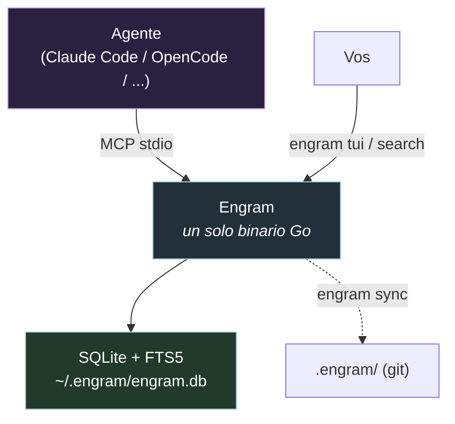
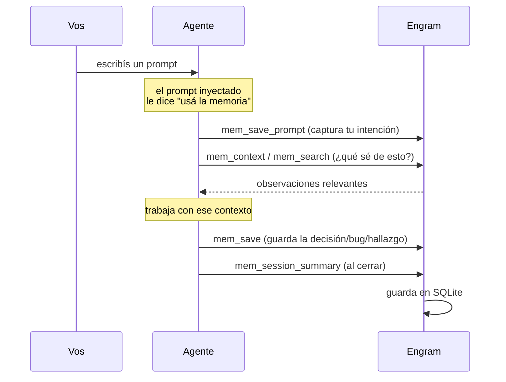

# Engram, explicado para dummies 🧠

> Qué es Engram, por qué existe, cómo funciona y cómo lo usa tu agente.
> Verificado contra `docs/engram.md`, `docs/codebase/memory-core.md`, el repo
> `engram` y el protocolo MCP del ecosistema.

---

## 0. El problema que resuelve (en una frase)

> **Tu agente de IA se olvida de TODO cuando cerrás la sesión. Engram le da un cerebro.**

Cada vez que abrís una sesión nueva, el agente arranca en cero: no se acuerda de qué
decidieron ayer, qué bug arreglaron, ni por qué eligieron tal arquitectura. Engram es una
**memoria persistente** que sobrevive entre sesiones (y entre compactaciones de contexto).

**Analogía:** sin Engram, el agente es como un empleado con amnesia que cada mañana no sabe
en qué proyecto está. Con Engram, es un empleado que tiene su cuaderno de siempre y lo relee
antes de arrancar.

> _Engram_ `/ˈen.ɡræm/` — en neurociencia: **la huella física de un recuerdo en el cerebro.**

---

## 1. Qué es, técnicamente

Engram es un **binario de Go** con **SQLite + FTS5** (búsqueda full-text), expuesto por
**cuatro vías**: CLI, API HTTP, servidor **MCP**, y una **TUI** interactiva. Funciona con
**cualquier agente** que soporte MCP (Claude Code, OpenCode, Gemini, Codex, Cursor, etc.).



- **Un solo binario, cero dependencias.** No hay servidor que levantar a mano.
- La base de datos vive en `~/.engram/engram.db`.
- Es **agent-agnostic**: el mismo cerebro sirve para todos tus agentes.

---

## 2. El límite: Gentle-AI NO es Engram

Esto confunde, así que ojo (lo mismo que dice `REVIEW`/`memory-core`):

| Responsabilidad | Dueño |
|-----------------|-------|
| Instalar/descargar el binario `engram` | **Gentle-AI** (`internal/components/engram/`) |
| Escribir la config MCP para el agente | **Gentle-AI** |
| Correr `engram setup` donde aplica | **Gentle-AI** |
| **Guardar y buscar** sesiones, observaciones, prompts, relaciones | **Engram** (proyecto externo) |

**Traducción:** Gentle-AI pone el enchufe y conecta los cables. Engram es el
electrodoméstico que realmente guarda la memoria. El código de la base de datos **no vive**
en el repo de Gentle-AI — vive en [github.com/Gentleman-Programming/engram](https://github.com/Gentleman-Programming/engram).

---

## 3. Los conceptos de memoria

Engram organiza la memoria en estas piezas:

| Concepto | Qué es |
|----------|--------|
| **Observation** (observación) | Una decisión, descubrimiento, arreglo de bug, patrón o convención guardada. Es la unidad básica de memoria. |
| **Session** (sesión) | Un período de trabajo que se puede resumir y recuperar después. |
| **Prompt** | El prompt del usuario, capturado para que un save posterior le adjunte la intención real. |
| **Relation** (relación) | Vínculos semánticos o juicios de conflicto entre memorias (ej.: esta decisión reemplaza aquella). |
| **Sync mutation** | Los cambios de export/import que se usan para compartir memoria en equipo. |

Las memorias se agrupan por **proyecto**, autodetectado desde el remote de git (desde v1.11.0):
lee la URL del remote, la normaliza a minúsculas, y la usa como nombre de proyecto. Si trabajás
fuera de un repo git, usa el nombre del directorio.

---

## 4. Cómo guarda y recupera (el flujo)



**En criollo:** el agente busca lo que ya sabe (`mem_search`/`mem_context`), trabaja, y va
guardando lo importante (`mem_save`) sin que vos le pidas nada. Al final resume la sesión
(`mem_session_summary`) para que la próxima arranque con contexto.

---

## 5. Las herramientas MCP (lo que usa el agente por detrás)

Vos **nunca** las llamás a mano, pero entenderlas te muestra qué está haciendo el agente.

### Core (las de siempre)

| Tool | Qué hace |
|------|----------|
| `mem_save` | Guarda una decisión, arreglo, descubrimiento o convención. |
| `mem_search` | Busca en memoria por keywords, devuelve observaciones que matchean. |
| `mem_context` | Trae el historial reciente de sesión (se llama al arrancar). |
| `mem_session_summary` | Guarda un resumen de fin de sesión para la próxima. |
| `mem_get_observation` | Trae el contenido completo de una observación por ID. |
| `mem_save_prompt` | Guarda tu prompt y alimenta la actividad para que un `mem_save` posterior lo capture/dedupe. |

> `mem_save` acepta un `capture_prompt` opcional. Para saves humanos/proactivos se deja sin
> setear; se usa `capture_prompt: false` solo para artefactos automáticos (reportes SDD,
> caches, output de skill-registry).

### Avanzadas (rara vez hacen falta)

| Tool | Qué hace |
|------|----------|
| `mem_update` | Actualiza una observación existente por ID. |
| `mem_suggest_topic_key` | Sugiere un topic key estable para temas que evolucionan. |
| `mem_session_start` / `mem_session_end` | Manejo del ciclo de vida de la sesión. |
| `mem_stats` | Estadísticas de memoria (conteo, breakdown por proyecto). |
| `mem_delete` | Borra una observación por ID. |
| `mem_timeline` | Vista cronológica de observaciones. |
| `mem_capture_passive` | Extrae aprendizajes de la conversación de forma pasiva. |
| `mem_merge_projects` | Fusiona variantes de nombre de proyecto (equivale a `engram projects consolidate`). |

---

## 6. Los comandos que SÍ usás vos (CLI)

Engram funciona solo. Estos comandos son para cuando querés inspeccionar, compartir o arreglar
memorias a mano:

```bash
# Ver las memorias visualmente (buscar, filtrar, entrar a cada observación)
engram tui

# Buscar desde la terminal, sin abrir la TUI
engram search "auth refactor"

# Exportar las memorias del proyecto a .engram/ para commitearlas a git
engram sync
```

`engram tui` es la forma más rápida de ver qué viene guardando tu agente. **Empezá por ahí.**

### Manejo de proyectos

```bash
engram projects list          # lista todos los proyectos con su conteo de observaciones
engram projects consolidate   # fusiona interactivamente nombres duplicados
```

Si ves el mismo proyecto bajo varios nombres (ej.: "my-app" vs "My-App"), consolidalos.

---

## 7. Compartir con el equipo (git sync)

Las memorias son **locales por defecto**. Para compartirlas por git:

```bash
# Después de una sesión — exportás a .engram/ en tu repo
engram sync

# En otra máquina — importás después de clonar
engram sync --import
```

Agregás `.engram/` al repo y lo commiteás. Cuando un compañero clona y corre `engram sync --import`,
recibe todo el contexto del proyecto. **Es buenísimo para onboarding**: el que entra arranca con
el conocimiento acumulado del equipo.

> ⚠️ Ojo: **no confundir** `engram sync` (exporta memoria a `.engram/`) con `gentle-ai sync`
> (refresca la config de los agentes). Son dos cosas distintas.

---

## 8. Cómo lo instala/configura Gentle-AI

- El componente `engram` (`internal/components/engram/`) descarga y verifica el binario, corre
  `engram setup` donde el agente lo soporta, e inyecta la config MCP.
- La config MCP invoca típicamente `engram mcp --tools=agent`.
- Para **Pi** es especial: Gentle-AI provisiona el Engram real, pero la config MCP la escribe
  `gentle-engram` vía `pi-engram init` (ver `08-PI-PARA-DUMMIES.md`).
- **Invariante:** el comando MCP tiene que ser estable; Gentle-AI prefiere paths estables y
  preserva paths absolutos existentes.

---

## 9. Detalles que conviene saber

- **Local o nube:** Engram es "one brain, local or cloud" — pero la parte cloud es una
  capacidad externa de Engram, **no** vive en el código de Gentle-AI.
- **Sobrevive a la compactación:** cuando el contexto se resume, el agente puede recuperar el
  hilo con `mem_context` + `mem_search`.
- **No inventa prompts:** si el server MCP no tiene contexto de prompt, `mem_save` igual funciona
  y no inventa texto.

---

## Glosario

- **Engram:** memoria persistente para agentes de IA (binario Go + SQLite/FTS5).
- **MCP:** el protocolo por el que el agente habla con Engram.
- **Observation:** una unidad de memoria (decisión, bug, hallazgo, convención).
- **Session:** un período de trabajo, resumible y recuperable.
- **Topic key:** una clave estable para agrupar memoria de un tema que evoluciona.
- **FTS5:** el motor de búsqueda full-text de SQLite que usa Engram.
- **Sync:** exportar/importar memoria a `.engram/` para compartir por git.

---

*Fuentes: `docs/engram.md`, `docs/codebase/memory-core.md`, repo `engram` (README),
protocolo MCP del ecosistema. Verificado contra el código y las docs.*
