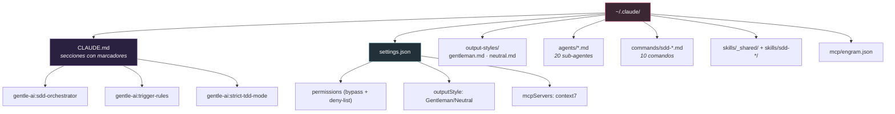

# Gentle-AI + Claude Code, para dummies 🤖

> Qué configura Gentle-AI cuando elegís Claude Code, qué archivos toca, qué te
> deja hacer y qué no, y cómo usa el SDD y el sistema de review.
> Verificado contra `internal/agents/claude/`, `internal/assets/claude/` y
> `internal/components/`.

---

## 0. En una frase

Claude Code es el agente **mejor soportado** de todo el ecosistema (tier `Full`, la
implementación de referencia). Gentle-AI le inyecta memoria, skills, el método SDD con
**sub-agentes reales** (Task tool), la personalidad Gentleman/Neutral como *output style*,
y el sistema de review por gates.

**Analogía:** si Gentle-AI amuebla casas, Claude Code es la casa modelo — la que tiene
todas las instalaciones puestas y probadas primero.

---

## 1. Qué archivos toca (el mapa)

Todo cuelga de `~/.claude/`:

| Archivo | Qué le pone |
|---------|-----------|
| `~/.claude/CLAUDE.md` | Secciones acotadas por marcadores `<!-- gentle-ai:... -->`: el orquestador SDD, las trigger-rules del review, y Strict-TDD si está activo. |
| `~/.claude/settings.json` | `permissions.defaultMode: bypassPermissions` + una **deny-list** dura; `outputStyle` (Gentleman/Neutral); el MCP de **context7**. |
| `~/.claude/output-styles/{gentleman,neutral}.md` | La personalidad como output style. |
| `~/.claude/agents/*.md` | **20 sub-agentes**: 10 de fases SDD, 4 lentes de review (4R), `review-refuter`, y 3 de Judgment Day (jd-judge-a/b, jd-fix-agent). Cada uno con su `model:` y su lista de tools. |
| `~/.claude/commands/sdd-*.md` | 10 slash-commands (`/sdd-apply`, `/sdd-continue`, etc.). |
| `~/.claude/skills/_shared/` | El workflow SDD lazy-loaded + los contratos compartidos. |
| `~/.claude/mcp/engram.json` | El MCP de Engram (archivo separado). |

> ⚠️ **Rareza importante:** los dos MCP caen en lugares distintos. **context7** se mergea
> dentro de `settings.json`, pero **engram** va a un archivo aparte `~/.claude/mcp/engram.json`.
> Si buscás context7 y no lo encontrás donde esperabas, es por esto.

---

## 2. Qué te permite hacer (y qué no)

**Permite:**
- **Delegación completa con sub-agentes reales** (Task tool). Cada fase SDD corre en su
  propio contexto aislado. Este es el modelo "full-delegation".
- **Output styles** — la persona Gentleman/Neutral como estilo nativo.
- **Modelo por fase** — cada sub-agente tiene su `model:` (y `effort:` opcional).
- **Slash commands y skills.**
- **Auto-aceptar permisos** — modo `bypassPermissions` con una deny-list dura
  (`rm -rf /`, `.env`, `.ssh`, credenciales AWS, keychains, etc.).

**NO hace:**
- **NO configura el modelo de la sesión principal** — eso lo maneja Claude Code solo. La
  tabla de modelos aplica **solo** a las llamadas Task de las fases SDD/JD, nunca a la
  delegación genérica.
- Los sub-agentes ejecutores **no pueden delegar** más (nada de orquestación recursiva).
- **No hay fallback programático de modelo**: si el modelo asignado no está, solo se le
  "sugiere" en prosa usar `sonnet` — no hay red de seguridad en código.

---

## 3. Cómo usa el SDD

- **Modelo full-delegation:** el orquestador vive en `~/.claude/CLAUDE.md` (sección con
  marcador); el workflow pesado se **carga lazy** desde
  `~/.claude/skills/_shared/sdd-orchestrator-workflow.md` (para mantener el CLAUDE.md fino).
- **Modelo por fase** (preset *Balanced* por defecto):

| Fase | Modelo |
|------|--------|
| propose · design | **opus** |
| explore · spec · tasks · apply · verify · jd-judges · jd-fix | **sonnet** |
| archive · onboard | **haiku** |
| orquestador | opus |

  Hay otros presets (Performance, Economy, Diversity). El `effort` (low→max) es opcional
  por fase y está limitado según el modelo (haiku no admite override; sonnet no admite `xhigh`).

- Cada sub-agente ejecutor tiene su lista de tools acotada (ej.: `sdd-apply` puede
  Read/Edit/Write/Bash + tools de Engram; las lentes de review son **solo lectura**).

---

## 4. Cómo usa el Review

- Las **trigger-rules** se inyectan en `~/.claude/CLAUDE.md` bajo el marcador
  `<!-- gentle-ai:trigger-rules -->`: un router determinístico (Low→0 lentes,
  Medium→1 lente, High/>400 líneas→las 4R).
- El agente corre el binario nativo en cada gate:
  `gentle-ai review validate --gate <gate> --cwd <repo>`.
- **Modo de ejecución "dedicated-agent":** cada lente `review-*` corre su propio barrido y
  devuelve filas de ledger; la refutación se abre a 1 (standard) o 3 (4R completo)
  `review-refuter`. Judgment Day usa jd-judge-a/b + jd-fix-agent (sin refuter).

> Para el detalle completo del sistema de review, ver `03-REVIEW-PARA-DUMMIES.md`.

---

## 5. Posibles problemas

1. **MCP en dos lugares** (context7 en settings.json, engram en archivo aparte) — confunde.
2. **Las lentes de review siempre usan `sonnet`** — no tienen fila propia en los presets, caen al `default`.
3. **El gate de "qué modelo usar" es solo prosa** — un modelo que ignore la instrucción no se bloquea por código.
4. **El modelo del orquestador no se puede controlar** desde Gentle-AI (por diseño).
5. **Dependencia de marcadores:** si se rompen los marcadores en el asset, la inyección falla con error.

---

## 6. Mantenimiento (al día de hoy)

**Muy activo y maduro.** Es la implementación de referencia (tier `Full`). El adapter es
una capa delgada y bien testeada; la lógica pesada (modelos, orquestador, review) vive en
`internal/components/sdd/` con un archivo de tests de ~7.000 líneas. La actividad reciente
se concentra en el ciclo de vida del review (commits de 2026-07-11).

**Veredicto comparativo:** Claude Code y OpenCode son los dos mejor mantenidos. Claude Code
es el **canónico / de referencia** — lo primero que se implementa y prueba. OpenCode va
codo a codo (ver su doc). Pi es sólido pero más nuevo.

---

*Fuentes: `internal/agents/claude/{adapter,paths}.go`, `internal/assets/claude/`,
`internal/components/{sdd,persona,mcp,permissions,engram}/`. Verificado contra el código.*
