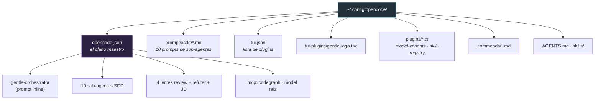

# Gentle-AI + OpenCode, para dummies 🧩

> Qué configura Gentle-AI cuando elegís OpenCode, qué archivos toca, qué te deja
> hacer y qué no, y cómo usa el SDD y el sistema de review.
> Verificado contra `internal/agents/opencode/`, `internal/opencode/`,
> `internal/components/sdd/` y `internal/components/opencodeplugin/`.

---

## 0. En una frase

OpenCode es agente **tier `Full`**, codo a codo con Claude Code. Su diferencia clave: en
vez de archivos sueltos por sub-agente, **todo vive dentro de un solo JSON**
(`opencode.json`), y suma dos features propias: **perfiles SDD** (sets de modelos
cambiables con Tab) y **plugins de TUI**.

**Analogía:** Claude Code guarda cada mueble en su cuarto; OpenCode mete todo el
mobiliario en un único plano maestro (el `opencode.json`) que se edita con cuidado.

---

## 1. Qué archivos toca (el mapa)

Todo cuelga de `~/.config/opencode/`:

| Archivo | Qué le pone |
|---------|-----------|
| `opencode.json` | El overlay de agentes: `gentle-orchestrator` (prompt **inline**), los 10 sub-agentes SDD, las lentes 4R + `review-refuter` + agentes JD, más los agentes de perfiles. También el MCP `codegraph` y el `model` raíz. |
| `prompts/sdd/*.md` | Los 10 prompts compartidos de sub-agentes (en modo multi se referencian por archivo). |
| `tui.json` | La lista de plugins: nombres de paquetes externos y/o la ruta del Gentle Logo. |
| `tui-plugins/gentle-logo.tsx` | El plugin visual del logo (rosa ASCII). |
| `plugins/*.ts` | Plugins runtime: `model-variants.ts` (escribe la cache de variantes) y `skill-registry.ts`. |
| `commands/*.md` | Slash-commands `/sdd-*` que apuntan a `agent: gentle-orchestrator`. |
| `AGENTS.md` · `skills/` | System prompt base y skills (en modo single los sub-agentes leen su SKILL.md). |

MCP: se mergea **dentro** de `opencode.json` (estrategia `MergeIntoSettings`), en formato
de comando local en array: `["codegraph","serve","--mcp"]`.

---

## 2. Qué te permite hacer (y qué no)

**Permite:**
- **Delegación con overlay multi-modo** — el `gentle-orchestrator` (modo `primary`) delega
  a todos los sub-agentes, lentes y agentes JD, todo declarado dentro del JSON.
- **Ruteo de modelo por fase** — vía perfiles (ver §3) y asignaciones por defecto.
- **Sub-agentes en background** nativos (con `OPENCODE_EXPERIMENTAL_BACKGROUND_SUBAGENTS=true`).
- **Slash commands, skills, MCP, system prompt.**

**NO hace:**
- **No hay output styles** (`SupportsOutputStyles=false`).
- **No escribe archivos sueltos por sub-agente** — todo va dentro del JSON.
- **No escribe variables de entorno** en el opencode.json.
- En modo `external-single-active` **no regenera** los perfiles con sufijo y **preserva** el
  prompt existente del orquestador.

---

## 3. Los perfiles SDD (la feature estrella de OpenCode)

Un **perfil SDD** es un set de asignaciones de modelo, materializado como agentes extra en
`opencode.json`, que cambiás con **Tab** en la TUI de OpenCode.

- Esquema de claves: `sdd-orchestrator-{nombre}` + `sdd-{fase}-{nombre}` para las 10 fases.
- El orquestador del perfil lleva el prompt **inline** y permisos de Task acotados solo a
  **sus** sub-agentes con sufijo (`*:deny`, solo los propios `allow`).
- Los 10 sub-agentes del perfil son `hidden`, con el prompt como **referencia a archivo**
  (`{file:.../prompts/sdd/{fase}.md}`); solo cambia `model`/`variant` por perfil.
- El prompt del orquestador embebe una **tabla de asignaciones de modelo** y reescribe las
  referencias `sdd-{fase}` a `sdd-{fase}-{nombre}`.
- Dos estrategias: `generated-multi` (por defecto) o `external-single-active` (si existen
  archivos en `~/.config/opencode/profiles/*.json`).

---

## 4. Cómo usa el SDD

- **Selección de overlay:** modo multi (`sdd-overlay-multi.json`) o single
  (`sdd-overlay-single.json`).
- **Modo multi:** los prompts de sub-agentes son **por archivo** (`{file:.../prompts/sdd/*}`).
- **Modo single:** los prompts son **strings inline** que le dicen al agente que lea su
  `~/.config/opencode/skills/{fase}/SKILL.md`.
- El prompt del orquestador **siempre va inline** (nunca por archivo).
- El agente canónico se llama **`gentle-orchestrator`**. El sync migra el legacy
  `sdd-orchestrator` → `gentle-orchestrator`.

---

## 5. Cómo usa el Review

- Las **trigger-rules** se inyectan **inline** dentro del prompt del `gentle-orchestrator`
  en el `opencode.json` (NO en AGENTS.md), como sección con marcador `trigger-rules`.
- Las **lentes de review** (`review-*`), `jd-judge-a/b` y `review-refuter` se declaran como
  agentes con tools bloqueadas a **solo lectura** (sin write/edit/bash/task).
- El agente corre `gentle-ai review start` cuando el status devuelve `nextRecommended: review`,
  y `gentle-ai review validate --gate <gate>` antes de commit/push/PR — según el contrato
  inline. El review lo dispara el modelo por CLI, no un plugin.

> Para el detalle completo del sistema de review, ver `03-REVIEW-PARA-DUMMIES.md`.

---

## 6. Los plugins de TUI

- **Plugins externos de comunidad** (ej.: statusline de sub-agentes, plugin de engram-manage):
  se registra el **nombre del paquete** en `tui.json` (idempotente, dedup).
- **Gentle Logo** (el logo local): se escribe `tui-plugins/gentle-logo.tsx` y se registra su
  **ruta absoluta** en `tui.json`.
- El uninstall gestionado tiene 4 capas y quita solo lo propio; los archivos con drift se
  preservan y reportan.

---

## 7. Posibles problemas

1. **Fragilidad del merge de `opencode.json`** — si el merge falla en silencio, los post-checks
   fallan duro pidiendo que existan `gentle-orchestrator`, `sdd-apply`, etc.
2. **Visibilidad en Windows/WSL2** — tras el rename atómico, una relectura puede no reflejar el
   write; se valida contra los bytes en memoria.
3. **Falsos positivos de "cambió"** — varias funciones evitan re-serializar para no reordenar
   claves (que dispararía el flag de cambio).
4. **`replacePhaseRef`** — como `sdd-{fase}` es prefijo de `sdd-{fase}-{nombre}`, hay lógica
   frágil de look-ahead para no doble-sufijar en re-runs.
5. **Plugins:** `tui.json` inparseable hace fallar (no salta en silencio). El Gentle Logo se
   registra por ruta absoluta → mover el directorio de config lo rompe.
6. **JSONC:** codegraph se detecta en `.json` y `.jsonc`, pero solo se escribe el `.json`.
7. **Effort:** los niveles de effort solo aparecen tras correr OpenCode una vez (para poblar la cache de variantes).

---

## 8. Mantenimiento (al día de hoy)

**Muy activo — posiblemente el más movido ahora mismo.** Los commits recientes (jul 14/15)
son casi todos de hardening de plugins, review y codegraph. Cobertura de tests fuerte:
tests dedicados de opencode + ~8 tests de contratos SDD/overlay (incluido un `inject_test.go`
de 243 KB).

**Veredicto comparativo:** OpenCode va **codo a codo con Claude Code** como mejor mantenido.
Claude Code es el canónico/de referencia; OpenCode es el más rico en features propias
(perfiles, plugins) y el que más churning tiene ahora. Pi es sólido pero más nuevo.

---

*Fuentes: `internal/agents/opencode/`, `internal/opencode/models.go`,
`internal/components/sdd/{inject,prompts,profiles}.go`,
`internal/components/opencodeplugin/`, `docs/opencode-profiles.md`. Verificado contra el código.*
