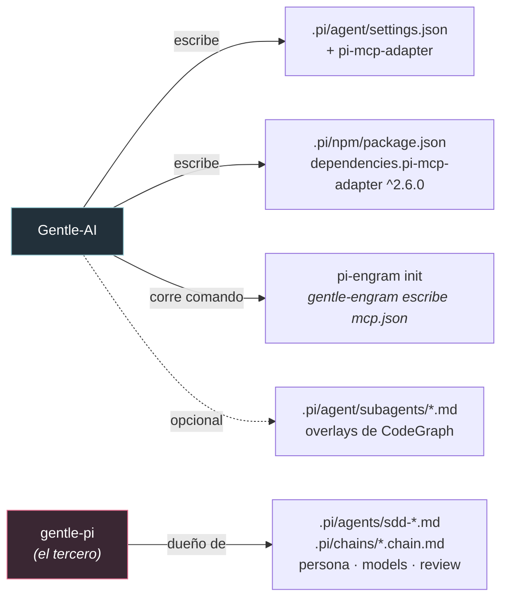
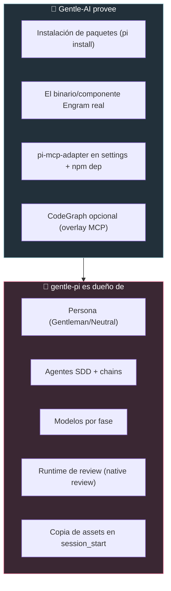

# Gentle-AI + Pi, para dummies 🥧

> Qué hace Gentle-AI cuando elegís Pi, qué archivos toca, qué permite y qué no,
> y — lo más importante — cómo se integra con **gentle-pi**, el tercero que
> realmente maneja el runtime de Pi.
> Verificado contra `internal/agents/pi/adapter.go`,
> `internal/components/communitytool/pi_codegraph.go` y `docs/pi.md`.

> **Pi es distinto a todos los demás.** Con Claude Code u OpenCode, Gentle-AI escribe
> la configuración directamente. Con Pi, Gentle-AI **instala un paquete de terceros
> (`gentle-pi`) y le cede el control del runtime.** Este documento explica el LADO de
> Gentle-AI. Para entender gentle-pi por dentro, ver `09-GENTLE-PI-PARA-DUMMIES.md`.

---

## 0. En una frase

Gentle-AI, para Pi, hace de **instalador y proveedor de infraestructura**: instala los
paquetes de Pi (incluido `gentle-pi`), provisiona el Engram real, y opcionalmente engancha
CodeGraph. Todo lo demás — persona, SDD, modelos, review runtime — **lo maneja gentle-pi
adentro de Pi**.

**Analogía:** en las otras casas Gentle-AI pone los muebles. En la casa de Pi, Gentle-AI
trae la conexión de luz y agua (Engram, paquetes) y contrata a otro equipo especializado
(`gentle-pi`) que amuebla a su manera.

---

## 1. Cómo detecta y maneja Pi

- Hay un adapter dedicado: `internal/agents/pi/adapter.go` (registrado en el factory y en el
  catálogo con `ConfigPath: ~/.pi`, tier `Full`).
- **Detección:** Pi se considera instalado cuando el binario `pi` está en el `PATH`. El
  preflight falla con *"Pi requires the `pi` executable in PATH"* si no está. Como su install
  corre npm/pnpm, también valida Node/npm.
- **Capacidades a propósito mínimas:** el adapter reporta `false` en slash-commands,
  sub-agentes, skills y output-styles; solo `true` en system-prompt y MCP. ¿Por qué? Porque
  **gentle-pi es dueño de esas superficies.**

---

## 2. La secuencia exacta de instalación

Gentle-AI corre estos pasos, en este orden (`adapter.go:237`):

```bash
pi install npm:gentle-pi
pi install npm:gentle-engram
pi install npm:pi-mcp-adapter
npm exec --yes --package gentle-engram@latest -- pi-engram init   # (usa pnpm dlx si hay pnpm)
pi install npm:pi-subagents-j0k3r
pi install npm:@juicesharp/rpiv-ask-user-question
pi install npm:pi-web-access
pi install npm:@juicesharp/rpiv-todo
pi install npm:pi-btw
```

| Paquete | Qué agrega |
|---------|-----------|
| `gentle-pi` | Persona, workflow SDD/OpenSpec, strict TDD, safety, skills, prompts, agentes SDD, chains, **y el review runtime**. |
| `gentle-engram` | Integración de Pi con Engram (memoria + tools MCP). No es el binario de Engram. |
| `pi-mcp-adapter` | Deja que Pi exponga servers MCP (incluido Engram). |
| `pi-engram init` | Inicializa la config MCP de Engram en Pi (la escribe gentle-engram, no Gentle-AI). |
| `pi-subagents-j0k3r` | Corre los agentes SDD desde `.pi/agents/`. |
| Los `rpiv-*`, `pi-web-access`, `pi-btw` | Ask-user, todos, acceso web, workflow BTW. |

> ⚠️ **Detalle clave:** para todos los demás agentes, "ya está instalado" corta la
> instalación. **Pi es la excepción** (`run.go:730`): la secuencia de paquetes se corre
> siempre, aunque `pi` ya esté presente.

---

## 3. Qué archivos toca (y qué preserva)



Lo que escribe **Gentle-AI**:
- `.pi/agent/settings.json` → agrega `npm:pi-mcp-adapter` al array `packages`. **Preserva** todo
  lo demás; solo saca un `pi-mcp-adapter` previo (para re-agregarlo limpio) y identidades legacy.
- `.pi/npm/package.json` → deep-merge de `dependencies.pi-mcp-adapter = ^2.6.0`, preservando el resto.

Lo que **NO** escribe: `~/.pi/agent/mcp.json`. Ese lo escribe `pi-engram init` (gentle-engram
es dueño del schema).

---

## 4. Qué NO hace Gentle-AI para Pi (porque lo hace gentle-pi)

Cuando Pi es el único agente elegido, Gentle-AI **reemplaza** el set completo de componentes
Gentleman por **solo Engram** (`validate.go:44`). O sea, **saltea**:
- La **persona** (Gentleman/Neutral).
- La **selección de componentes** del ecosistema (sdd, skills, theme, permisos...).
- Los prompts de **Strict TDD**.

La TUI también corta su navegación normal para Pi-only, así no te pasea por pantallas de
persona/componentes.

**¿Por qué?** Porque `gentle-pi` es dueño de la persona, los modelos, los agentes SDD, las
chains, la memoria y el runtime del review. Si Gentle-AI las escribiera, chocaría con gentle-pi.

---

## 5. El Engram para Pi

Gentle-AI provisiona el **componente Engram real** por separado (descarga y verifica el binario)
y, en el paso de inyección, en vez de escribir un MCP como en los otros agentes, **delega** en
`ProvisionEngramMCP` del adapter de Pi (declara `pi-mcp-adapter` + agrega la dependencia npm).
Así `gentle-engram` tiene un runtime de Engram real con quien hablar.

---

## 6. El límite / handoff con gentle-pi



El código refuerza este límite en varios lados: CodeGraph marca a Pi como
`reconciledCompatibility` (no `native`), y excluye explícitamente el system-prompt de Pi de
las rutas que toca.

---

## 7. CodeGraph opcional para Pi

Todo en `internal/components/communitytool/pi_codegraph.go`. Es la parte **más nueva y menos
asentada** de la integración.

| Área | Comportamiento de Gentle-AI |
|------|------------------------------|
| MCP | Mergea `mcpServers.codegraph` con `codegraph serve --mcp`. Si hay una entrada del usuario **distinta**, **falla y NO sobreescribe**. |
| Children | Descubre child agents de usuario y proyecto. Los compatibles (`bash` + tools) reciben `mcp`; todos reciben guía de lazy-init. |
| Overlays | A los child "package-owned" no los edita: crea un overlay del mismo nombre en `.pi/agent/subagents/`. |
| Sync | `gentle-ai sync` reconcilia el manifest propio, restaurando overlays faltantes sin duplicar. |
| Remoción | El uninstall quita solo lo del manifest; los archivos con drift se preservan y reportan. |

---

## 8. Posibles problemas

1. **`pi -ns` saltea los hooks de startup** — si arrancás Pi así, gentle-pi no corre su
   `session_start`, y los agentes SDD pueden "faltar". Es comportamiento de Pi/gentle-pi;
   Gentle-AI no lo puede compensar.
2. **Conflictos de MCP** — una entrada `codegraph` previa distinta hace fallar el reconcile
   (no sobreescribe). Un child mal configurado hace fallar la verificación.
3. **Archivos child con drift** — en uninstall no se auto-limpian; se preservan y reportan.
4. **Salud pendiente del adapter MCP** — la salud del pi-mcp-adapter no siempre es verificable;
   se degrada a un estado "pending" no-fatal (fue fuente repetida de fallos de onboarding, ya
   endurecida en varios commits recientes).
5. **Orden de uninstall del `mcp.json` compartido** — la entrada de Pi se quita antes de que
   Engram toque el archivo compartido, para no confundir con drift del usuario.

---

## 9. Mantenimiento (al día de hoy)

**Reciente y en movimiento.** El core (install de paquetes + provisión de Engram, `adapter.go`)
está **relativamente estable**. La **reconciliación de CodeGraph para Pi es lo más nuevo** y la
que más hardening post-release tuvo (casi todos los commits recientes son `fix(pi)` / `fix(codegraph)`).

**Veredicto comparativo:** entre los tres, **Claude Code y OpenCode son los mejor mantenidos y
más maduros** (implementación de referencia y la más rica en features, respectivamente). **Pi es
sólido pero el más nuevo**, con la superficie de CodeGraph todavía asentándose. Dicho esto, el
tercero `gentle-pi` está **muy activamente mantenido** (releases casi diarias) — ver su doc.

---

*Fuentes: `internal/agents/pi/adapter.go`, `internal/components/communitytool/pi_codegraph.go`,
`internal/components/engram/inject.go`, `internal/cli/{validate,run}.go`, `docs/pi.md`.
Verificado contra el código.*
