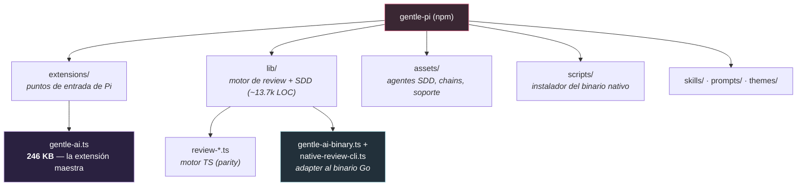
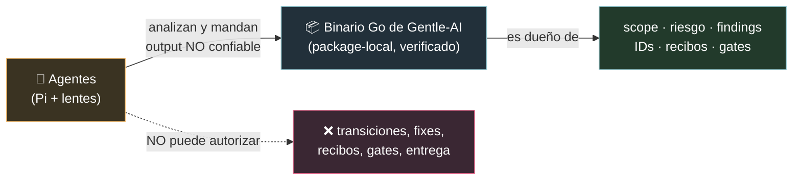

# gentle-pi, explicado para dummies 🌹🥧

> Qué es gentle-pi, cómo está armado, qué hace por dentro, y cómo se relaciona con
> Gentle-AI. Punto por punto, coma por coma, en criollo.
> Verificado contra el repo `gentle-pi` (v1.0.6), actualizado con `git pull` antes de analizar.

> **Contexto:** `gentle-pi` es un proyecto SEPARADO de Gentle-AI. Gentle-AI lo *instala*
> como paquete (ver `08-PI-PARA-DUMMIES.md`), pero gentle-pi es el que realmente maneja el
> runtime de Pi. Este documento lo explica por dentro.

---

## 0. En una frase

**gentle-pi es un paquete npm que convierte al agente Pi en "el Gentleman":** le pone la
persona de arquitecto senior, el método SDD/OpenSpec, strict TDD, guardas de seguridad,
descubrimiento de skills, y — su pieza estrella — un **runtime de review acotado** que ata
las decisiones de entrega a **evidencia derivada de Git por un binario nativo verificado**,
no a lo que el agente narra.

**Analogía:** si Pi es un auto, gentle-pi es un kit completo que lo convierte en auto de
carrera con copiloto experto — y ese copiloto NO te cree cuando decís "está todo bien":
exige que un instrumento certificado (el binario nativo) lo confirme.

**Datos duros:** npm package `gentle-pi` v1.0.6, MIT, ~13.720 líneas de TypeScript en `lib/`,
58 archivos de test (~690 casos). Se distribuye como **fuente** (sin build): Pi corre los `.ts`
directo con `node --experimental-strip-types`.

---

## 1. Cómo está armado (estructura)

| Carpeta | Qué tiene |
|---------|-----------|
| `extensions/` | Los puntos de entrada que Pi carga. El más grande: `gentle-ai.ts` (**246 KB**) — inyecta la persona, registra el tool `gentle_review` y todos los comandos `/gentle:*`, orquesta el review y los gates, refresca assets SDD en `session_start`. |
| `lib/` | El motor. Dos subsistemas: **SDD** (`sdd-preflight.ts`, `sdd-status.ts`, `openspec-*.ts`) y **Review** (los `review-*.ts`, que son la mayor parte). |
| `assets/agents/` | Agentes SDD (`sdd-*.md`), lentes de review (`review-*.md`), Judgment Day (`jd-*.md`). |
| `assets/chains/` | Cadenas de fases: `sdd-full`, `sdd-plan`, `sdd-verify`, `4r-review`. |
| `scripts/` | El instalador del binario nativo (`gentle-ai-installer.mjs`) + verificación de paquete. |
| `tests/` | 58 archivos, ~690 casos, concentrados en el review. |

---

## 2. La persona

- Dos modos: `gentleman` (voseo rioplatense cuando escribís en español) y `neutral`
  (español profesional, prohíbe el voseo).
- Se guarda en `~/.pi/gentle-ai/persona.json` (global) y `.pi/gentle-ai/persona.json` (proyecto).
- Orden de resolución: proyecto → global → default `gentleman`.
- Se cambia con `/gentle:persona`.

---

## 3. El SDD dentro de Pi

- **Agentes** (`assets/agents/sdd-*.md`): cada uno es una definición de agente Pi con
  frontmatter (`name`, `description`, `tools`) + contrato en el cuerpo.
- **Chains** (`assets/chains/sdd-*.chain.md`): `sdd-full.chain.md` es el pipeline completo
  `init → explore → proposal → spec → design → tasks → apply → verify → sync → archive`, con
  una guarda de modo interactivo (para en cada frontera de fase).
- **Instalación en `session_start`:** `installSddAssets()` copia `assets/agents`, `chains` y
  `support` al home de Pi (`~/.pi/agent/...`), rastreado por un manifest. Los `.pi/agents`/
  `.pi/chains` locales del proyecto se tratan como overrides manuales y **nunca se pisan**.
- **Preflight:** detecta pedidos explícitos de SDD (regex en inglés y español rioplatense,
  incluyendo patrones negativos como "sin usar sdd"), y pregunta modo (interactivo/auto),
  store de artefactos (openspec/engram/both), estrategia de PR y presupuesto de review (default 400).
- **Strict-TDD:** archivos de soporte `strict-tdd.md` y `strict-tdd-verify.md`.

---

## 4. El runtime de Review (la pieza estrella) 🔒

Acá está lo interesante. gentle-pi tiene **DOS cosas a la vez**: un motor de review en
TypeScript **y** un adapter estricto a un binario Go de Gentle-AI. La relación es
**parity port + delegación**.

### 4.1 El modelo de confianza (lo más importante)

Los agentes **analizan** el candidato y mandan output, pero ese output **no confiable no puede
autorizar nada**. El binario Go, package-local y verificado, es el único dueño del scope, el
riesgo, los findings, los IDs, la canonicalización, los recibos y los gates. Esto es lo mismo
que el sistema de review de Gentle-AI (ver `03-REVIEW-PARA-DUMMIES.md`), pero ejecutado desde Pi.

### 4.2 El binario package-local (`lib/gentle-ai-binary.ts`)

- Fija la versión exacta: **`gentle-ai 2.1.5`**.
- Resuelve **solo** la ruta package-local: `<packageRoot>/.gentle-ai/v2.1.5/gentle-ai`.
- Antes de devolver la ruta, exige una cadena de seguridad dura: ruta absoluta y confinada,
  directorios y binario **sin symlinks**, bit ejecutable POSIX, y un `integrity.json` cuyo
  `version/asset/assetSha256/binarySha256` tiene que matchear el asset del release **y** el
  SHA-256 real del binario en disco. Además hace un recheck TOCTOU (`lstat` antes/después).
- Si algo falla: `package-local-binary-missing`. **No hay fallback** a PATH, global, ni symlink.
  Esto es lo que sostiene la promesa de "runtime nativo verificado".

### 4.3 El adapter de CLI (`lib/native-review-cli.ts`)

- Operaciones: `version`, `review/start`, `review/finalize`, `review/validate`,
  `review/bind-sdd`, `sdd-status`, `review/status`.
- Ejecuta con `execFile` (**sin shell**), con timeout, límite de output y soporte de cancelación.
- **Re-chequea la versión del binario antes de CADA operación** y falla con
  `version-incompatible`/`identity-mismatch` si hay drift.

### 4.4 La vista del candidato (`lib/review-candidate-view.ts`)

Construye una **vista inmutable y congelada** del árbol, para que las lentes vean una foto fija
y no el disco en vivo (preserva árbol completo, rutas, modos, symlinks e índice).

### 4.5 El controlador y el quarantine

- El controlador y los gates viven **dentro** del `extensions/gentle-ai.ts` (246 KB) — no hay
  archivos `review-controller.ts` ni `review-gate.ts` sueltos. El tool se llama `gentle_review`.
- `lib/native-review-authority-quarantine.ts` está **intencionalmente vacío** (`export {}`):
  codifica que *"la autoridad de review nativa es solo-lectura en Pi; la remediación nativa no
  está disponible a propósito"*. No es un archivo sin terminar — es un marcador semántico.
- `lib/native-review-remediation.ts` clasifica autoridad inválida/mixta y decide si se permite
  un reset destructivo.

### 4.6 El motor TS de parity (`lib/review-*.ts`)

Es una **reimplementación en TypeScript que espeja el modelo de review de Go**:
`review-transaction.ts` (106 KB, recibos/ledgers/gates), el modelo compact-v2 de 5 estados
(`reviewing/correction_required/validating/approved/escalated`), las políticas ordinary y
Judgment Day, el riesgo, snapshots, etc.

**¿Cómo se reparten el trabajo el binario Go y el motor TS?**
- El review ordinario (start/finalize/validate) se **delega al binario Go** cuando está disponible.
- El motor TS provee: (1) el **contrato canónico** para construir inputs y validar outputs del
  nativo (parity), (2) los caminos **legacy graph-v1** y **Judgment Day** (que sigue siendo
  mutable en graph-v1), y (3) la lógica de inspección/reset/supersession de autoridad legacy.

---

## 5. Cómo se relaciona con Gentle-AI

**Las dos cosas a la vez:** gentle-pi **shellea al binario Go de `gentle-ai`** para la autoridad
de review ordinaria, **y** mantiene una **reimplementación de parity en TypeScript** del contrato.

- **Provisión:** `scripts/gentle-ai-installer.mjs` baja el archivo exacto por plataforma
  (6 targets: darwin/linux/windows × amd64/arm64), verifica el SHA-256 del archivo **y** del
  binario extraído, y lo promueve atómicamente a `.gentle-ai/v2.1.5/`. Corre en `postinstall`.
  Opt-out offline: `GENTLE_PI_SKIP_GENTLE_AI_INSTALL=1` (después las ops nativas fallan cerradas).
- **Contrato exacto:** el adapter soporta **solo `gentle-ai 2.1.5`** y re-chequea la versión antes
  de cada operación.
- **Test de parity:** `tests/native-review-parity-runtime.test.ts` resuelve el binario **real**,
  fija su SHA-256, y corre el flujo end-to-end (start→finalize→gate) contra el binario Go real,
  comparando digests. **Esto es lo que garantiza la paridad Go↔TS.**

**En resumen:** gentle-pi NO reimplementa la *autoridad* en TS para el review ordinario en
producción — la delega al binario Go. El código TS `lib/review-*` es (a) el contrato/canonicalización
compartido para construir y validar el I/O nativo, y (b) la implementación viva para lecturas
legacy graph-v1, Judgment Day, resets y supersession.

---

## 6. Los comandos de Pi

Registrados en `extensions/gentle-ai.ts`, todos bajo el prefijo **`/gentle:`** (más los `sdd-*` pelados):

| Comando | Qué hace |
|---------|----------|
| `/gentle:install-sdd` (+ `--force`) | (Re)instala assets SDD sin pisar archivos locales. |
| `/gentle:sdd-preflight` | Corre el preflight de preferencias SDD. |
| `/sdd-init` · `/sdd-status` · `/sdd-continue` | Bootstrap / estado / próxima fase del SDD. |
| `/gentle:models` | Modal de asignación de modelos por agente. |
| `/gentle:persona` | Cambia entre `gentleman` y `neutral`. |
| `/gentle:doctor` | Diagnóstico read-only (incluye chequeo de Engram activo). |
| `/gentle:status` | Estado de paquetes, assets SDD, OpenSpec y config de modelos. |
| `/skill-registry:refresh` | Mantiene `.atl/skill-registry.md`. |
| `/gentle:banner` y variantes | Controlan el banner de inicio (rosa/logo ASCII). |

> ⚠️ **Discrepancia con la doc:** `docs/pi.md` de Gentle-AI menciona `/gentleman:persona` y
> `/gentle-ai:status`, pero el **código real de gentle-pi v1.0.6 usa el prefijo `/gentle:`**
> (`/gentle:persona`, `/gentle:status`). El código manda.

---

## 7. La memoria

gentle-pi **no provee memoria persistente por sí mismo**. Se integra con **gentle-engram / Engram
MCP** solo cuando esos tools están disponibles:
- Sondea la capacidad con `hasWritableEngramTool()` (busca un tool `mem_save`).
- La persona tiene reglas explícitas: *"nunca afirmar que hay memoria persistente por este paquete"*
  y *"mencionar memoria solo cuando los tools de memoria estén realmente activos"*.
- En modo memoria, los artefactos SDD usan topic keys estables `sdd/<cambio>/{proposal,spec,...}`.
- Contrato de delegación: el padre recupera memoria y la pasa a los sub-agentes; los sub-agentes
  no buscan solos, pero guardan descubrimientos antes de volver.

---

## 8. Posibles problemas / gotchas

1. **Drift del string de versión:** `scripts/install-gentle-ai.mjs` loguea *"Gentle AI v2.1.4"*
   mientras la versión fijada es **2.1.5** en todo el resto. Es cosmético, pero es señal de que
   el log del postinstall no se actualizó.
2. **Clases de adapter versionadas:** conviven `NativeReviewCliV213` y `NativeReviewCliV214`; el
   nombre de clase (`V214`) va atrás de la versión del binario (2.1.5) — inconsistencia de nombres.
3. **`native-review-authority-quarantine.ts` vacío a propósito** — no lo confundas con no-terminado.
4. **No hay `review-controller.ts` / `review-gate.ts` sueltos** — esa lógica vive dentro del
   `gentle-ai.ts` de 246 KB. Ese tamaño de archivo único es en sí una preocupación de mantenibilidad.
5. **Fail-closed duro del binario:** con `GENTLE_PI_SKIP_GENTLE_AI_INSTALL=1` o si falla la
   integridad, TODAS las ops nativas tiran `package-local-binary-missing`. No hay modo degradado
   en producción, a propósito.
6. **Prefijo de comandos** `/gentle:` (no `/gentleman:` ni `/gentle-ai:` como sugiere docs/pi.md).
7. **Gaps deliberados que fallan cerrados:** la proyección `staged` del nativo no está expuesta;
   split fetch/push no soportado; primer push nativo no soportado hasta que haya una base anunciada.
8. **Peligro de downgrade:** una vez que v2.1.5 escribió autoridad, no corras un binario más viejo
   contra el repo.

---

## 9. Mantenimiento (al día de hoy)

**Muy activamente mantenido.** Los últimos 5 commits son de **hoy** (2026-07-15), incluida la
release **1.0.6**. La historia reciente está dominada por hardening del native-review
(normalización de plataforma win32→windows, alineación con Gentle-AI v2.1.2, base commiteada, etc.).

**Cobertura de tests: pesada.** 58 archivos `.test.ts`, ~690 casos, concentrados en el review:
`review-controller-native-routing` (124 casos), `native-review-cli` (43), `review-controller` (40),
`review-gate` (27), `review-candidate-view` (25). Corren sin compilar
(`node --experimental-strip-types --test`).

**Veredicto:** gentle-pi es un paquete maduro y muy testeado cuyo rasgo definitorio es el
**review nativo acotado**: un adapter TS estricto que delega la autoridad a un binario Go de
Gentle-AI v2.1.5 fijado por SHA-256, envuelto por un motor TS de parity que es dueño del contrato
canónico, el legacy graph-v1, Judgment Day, reset y supersession.

---

*Fuentes: repo `gentle-pi` (v1.0.6) — `extensions/gentle-ai.ts`, `lib/gentle-ai-binary.ts`,
`lib/native-review-cli.ts`, `lib/review-candidate-view.ts`, `lib/review-*.ts`,
`scripts/gentle-ai-installer.mjs`, `tests/`, `README.md`. Actualizado con git pull y verificado
contra el código.*
