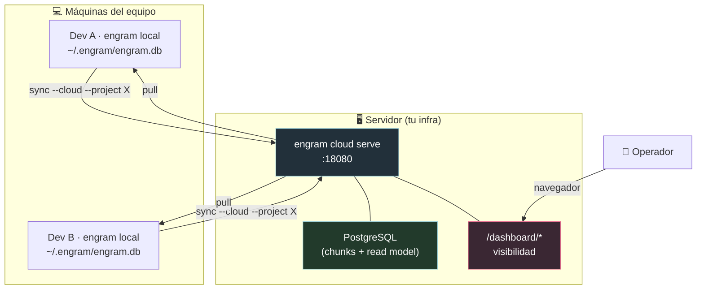
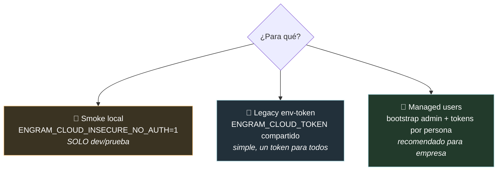

# Engram Cloud, para dummies (+ guía de empresa) ☁️

> Qué es Engram Cloud, cómo funciona, y — sobre todo — **cómo ponerlo a funcionar en la
> empresa** paso a paso. Verificado contra el repo `engram`:
> `docs/engram-cloud/{README,quickstart,troubleshooting}.md`, `docs/ENGRAM-CLOUD.md`,
> `DOCS.md` (secciones Cloud CLI, Managed users, Autosync). Repo actualizado con git pull.

> **Contexto:** Engram Cloud vive en el proyecto `engram` (no en gentle-ai). Es la capa
> opcional de replicación en equipo. Ver también `04-ENGRAM-PARA-DUMMIES.md` para la memoria local.

---

## 0. Qué es (y qué NO es)

> **Usá Engram Cloud cuando querés memoria compartida por proyecto entre máquinas, sin
> perder la propiedad local-first.**

La regla de oro: **el SQLite local sigue siendo la fuente de verdad.** Engram Cloud es
**replicación opcional + visibilidad en el navegador** para equipos y operadores.

| ES | NO ES |
|----|-------|
| Replicación **por proyecto** (cada sync se ata a un `--project` explícito) | NO es cloud-only |
| Runtime self-hosted (`engram cloud serve` en tu infra) | NO es "sincronizá todo" implícito |
| Dashboard en el navegador (`/dashboard/*`) | NO reemplaza al SQLite local |
| Señales de estado/falla determinísticas (reason codes claros) | |

**Analogía:** cada desarrollador tiene su cuaderno local (SQLite). Engram Cloud es la
fotocopiadora compartida de la oficina: subís/bajás páginas por proyecto cuando querés, pero
tu cuaderno sigue siendo tuyo y autoritativo.

---

## 1. Arquitectura



Cada dev sincroniza su memoria local con el servidor cloud (por proyecto). El servidor
guarda en **Postgres** y expone un **dashboard** para ver qué hay.

---

## 2. El "runtime split" (importante)

Hay **dos** runtimes distintos, no los confundas:

| Runtime | Comando | Qué expone |
|---------|---------|------------|
| **Local** | `engram serve` | API de memoria local + `GET /sync/status` |
| **Cloud** | `engram cloud serve` | `GET /health`, `GET /sync/pull`, `POST /sync/push`, `GET /dashboard/*` |

El **cloud** es el que corrés en el servidor de la empresa. El **local** es el que corre en
cada máquina de dev (y del que sale/entra la memoria).

---

## 3. Los tres modos de autenticación



1. **Smoke (inseguro):** `ENGRAM_CLOUD_INSECURE_NO_AUTH=1`. Sin auth, para probar en tu máquina. **Nunca en producción.**
2. **Legacy env-token:** un `ENGRAM_CLOUD_TOKEN` compartido (bearer) + `ENGRAM_CLOUD_ALLOWED_PROJECTS`. Simple: un token para todo el equipo.
3. **Managed users (recomendado para empresa):** creás un admin gestionado y **un token por persona**, con grants por proyecto (deny-by-default). Requiere `ENGRAM_CLOUD_TOKEN_PEPPER`.

> Se pueden combinar: si activás managed tokens (con pepper), el server resuelve **primero**
> los managed y **después** cae al legacy. No hace falta migrar nada para volver al legacy.

---

## 4. 🏢 Puesta en marcha en la empresa (la parte importante)

### Paso 0 — Probar local primero (entender el flujo)

Antes de tocar el servidor, corré el smoke en tu máquina para ver que todo enciende:

```bash
docker compose -f docker-compose.cloud.yml up -d       # arranca cloud + Postgres (modo inseguro)
engram cloud config --server http://127.0.0.1:18080
engram cloud enroll smoke-project
engram sync --cloud --project smoke-project
engram sync --cloud --status --project smoke-project
# Dashboard: http://127.0.0.1:18080/dashboard
```

### Paso 1 — Deploy de producción con la imagen oficial (GHCR)

**No compiles desde el código para producción.** Usá la imagen publicada:
`ghcr.io/gentleman-programming/engram:latest` (soporta `linux/amd64` y `linux/arm64`).

En el servidor (`/opt/engram/`), poné un `docker-compose.yml` y un `.env`:

```yaml
# docker-compose.yml
services:
  postgres:
    image: postgres:16-alpine
    restart: unless-stopped
    env_file: [.env]
    environment:
      POSTGRES_USER: ${POSTGRES_USER}
      POSTGRES_PASSWORD: ${POSTGRES_PASSWORD}
      POSTGRES_DB: ${POSTGRES_DB}
    volumes:
      - engram-cloud-pg:/var/lib/postgresql/data
    healthcheck:
      test: ["CMD-SHELL", "pg_isready -U engram -d engram_cloud"]
      interval: 10s
      timeout: 5s
      retries: 10

  cloud:
    image: ghcr.io/gentleman-programming/engram:latest
    restart: unless-stopped
    depends_on:
      postgres: { condition: service_healthy }
    env_file: [.env]
    ports:
      - "18080:18080"

volumes:
  engram-cloud-pg:
```

```dotenv
# .env  — NUNCA lo commitees; queda solo en el servidor
POSTGRES_USER=engram
POSTGRES_PASSWORD=<password-fuerte-postgres>
POSTGRES_DB=engram_cloud

ENGRAM_DATABASE_URL=postgres://engram:<password-fuerte-postgres>@postgres:5432/engram_cloud?sslmode=disable
ENGRAM_CLOUD_TOKEN=<bearer-token-largo-y-random>
ENGRAM_CLOUD_ADMIN=<token-admin-DISTINTO-del-anterior>
ENGRAM_JWT_SECRET=<secreto-random-32+-bytes>
ENGRAM_CLOUD_ALLOWED_PROJECTS=gentle-ai,mi-app,otro-proyecto
ENGRAM_CLOUD_HOST=0.0.0.0
ENGRAM_PORT=18080
ENGRAM_CLOUD_MAX_PUSH_BYTES=8388608
# Solo si vas a usar usuarios/tokens gestionados (paso 2):
ENGRAM_CLOUD_TOKEN_PEPPER=<otro-secreto-DISTINTO-del-JWT>
```

```bash
cd /opt/engram && docker compose up -d
```

Después poné un **reverse proxy con TLS** (Dokploy/Coolify/Caddy/Nginx) delante del puerto
`18080`, así el equipo pega a `https://engram.tu-empresa.com`.

> **Reglas que importan:** en modo autenticado, `ENGRAM_JWT_SECRET` tiene que ser explícito y
> no-default; `ENGRAM_CLOUD_ALLOWED_PROJECTS` es **obligatorio** siempre (incluso inseguro);
> `ENGRAM_CLOUD_ADMIN` debe ser **distinto** de `ENGRAM_CLOUD_TOKEN`; `INSECURE_NO_AUTH` **no**
> se combina con `ENGRAM_CLOUD_TOKEN`.

### Paso 2 — (Recomendado) Crear el admin y tokens por persona

En vez de un token único compartido, creá usuarios gestionados. Con `ENGRAM_CLOUD_TOKEN_PEPPER`
seteado en el server:

```bash
# Crea el primer admin gestionado y le emite un token (se imprime UNA sola vez)
engram cloud bootstrap admin --username alice \
  --grant-project mi-app \
  --issue-token token-alice
```

- `--grant-project` se repite para varios proyectos. **Deny-by-default:** sin grant, ese
  usuario no sincroniza nada.
- El token crudo se imprime **una única vez** — guardalo al toque (no se re-muestra ni se loguea).
- Correr bootstrap de nuevo cuando ya hay admin **se rechaza** (no duplica). Todo intento queda
  en el audit log.
- Revocar un usuario/token o quitar un grant corta el acceso **en el próximo request**, sin reiniciar.

### Paso 3 — Setup de cada desarrollador (cliente)

En la máquina de cada dev:

```bash
engram cloud config --server https://engram.tu-empresa.com   # guarda la URL en ~/.engram/cloud.json
export ENGRAM_CLOUD_TOKEN=<token-de-esa-persona>             # el token va por env, NO en el archivo
engram cloud enroll mi-app                                    # enrola el proyecto
engram sync --cloud --project mi-app                          # sync explícito
engram sync --cloud --status --project mi-app                 # verificar
```

> El server URL se guarda en `~/.engram/cloud.json`. **El token se lee del entorno a propósito**
> (no se persiste en el archivo).

### Paso 4 — (Opcional) Autosync: memoria en background para el equipo

Para que cada dev sincronice solo, sin correr `sync` a mano, activá autosync al levantar el
runtime local (`engram serve` o `engram mcp`). Necesita **las tres** variables:

```bash
ENGRAM_CLOUD_AUTOSYNC=1 \
ENGRAM_CLOUD_TOKEN=<token-de-esa-persona> \
ENGRAM_CLOUD_SERVER=https://engram.tu-empresa.com \
engram serve
```

> Ojo: autosync usa `ENGRAM_CLOUD_SERVER` (variable de entorno), no el `cloud.json`. Debe ser
> **exactamente** `ENGRAM_CLOUD_AUTOSYNC=1` (no `true` ni `yes`). Si falta token o server, loguea
> un `ERROR` y sigue sin autosync (no rompe el arranque).

---

## 5. Referencia de variables de entorno

### Servidor (`engram cloud serve`)

| Variable | Req. | Notas |
|----------|:----:|-------|
| `ENGRAM_DATABASE_URL` | ✅ | DSN de Postgres para chunks/dashboard. |
| `ENGRAM_CLOUD_ALLOWED_PROJECTS` | ✅ | Allowlist separada por comas (siempre, incluso inseguro). `*` = todos. |
| `ENGRAM_CLOUD_TOKEN` | ✅ (auth) | Bearer token; activa modo autenticado. |
| `ENGRAM_JWT_SECRET` | ✅ (auth) | 32+ bytes, explícito y no-default. |
| `ENGRAM_CLOUD_HOST` | — | Bind host. Default `127.0.0.1`; en contenedor **`0.0.0.0`**. |
| `ENGRAM_PORT` | — | Puerto (default `8080`; el ejemplo GHCR usa `18080`). |
| `ENGRAM_CLOUD_ADMIN` | — | Token admin del dashboard (distinto del token). Rechazado en modo inseguro. |
| `ENGRAM_CLOUD_TOKEN_PEPPER` | — (✅ para managed) | Secreto de hash de tokens gestionados; **distinto** del JWT. |
| `ENGRAM_CLOUD_MAX_PUSH_BYTES` | — | Límite de body de push (default `8388608` = 8 MiB). |
| `ENGRAM_CLOUD_INSECURE_NO_AUTH` | — | `1` solo para smoke local. No se combina con token. |

### Cliente / Autosync

| Variable | Dónde | Notas |
|----------|-------|-------|
| `ENGRAM_CLOUD_TOKEN` | cliente | Token bearer (por env, no en archivo). |
| `ENGRAM_CLOUD_AUTOSYNC` | `engram serve`/`mcp` | Exactamente `1` para activar. |
| `ENGRAM_CLOUD_SERVER` | autosync | URL base del cloud (para autosync). |
| `~/.engram/cloud.json` | cliente | Guarda la URL del server (vía `engram cloud config`). |

---

## 6. El dashboard

- URL: `https://engram.tu-empresa.com/dashboard`.
- En modo autenticado, `/dashboard/login` cambia el bearer por una **cookie HttpOnly** scopeada
  a `/dashboard`. Las rutas HTML del dashboard requieren esa cookie (no aceptan el header Bearer crudo).
- `/dashboard/admin` solo se habilita para sesiones con el token exacto de `ENGRAM_CLOUD_ADMIN`.
- En smoke (inseguro), el login se saltea y `/dashboard/login` redirige a `/dashboard/`.
- Las rutas de sync (`/sync/*`) son siempre header-auth (no cookie).

---

## 7. Verificación y troubleshooting

**Triage rápido:**

```bash
engram version                                  # cliente y server misma versión (el skew bloquea)
engram cloud status                             # configured + auth ready
engram cloud upgrade doctor --project <proj>    # ready | blocked (con reason)
engram sync --cloud --status --project <proj>   # ¿avanza last_acked_seq?
```

**Reason codes que vas a ver:**

| Código | Significa | Qué mirar |
|--------|-----------|-----------|
| `blocked_unenrolled` | El proyecto no está enrolado | `engram cloud enroll <proj>` |
| `auth_required` / `401` | Token inválido/rechazado | `ENGRAM_CLOUD_TOKEN` en cliente y server |
| `policy_forbidden` / `403` | Proyecto sin permiso | `ENGRAM_CLOUD_ALLOWED_PROJECTS` (o grant del managed user) |
| `cloud_config_error` | Falta/está mal la URL del server | `engram cloud config --server ...` |
| `paused` | Sync pausado en el control plane | Despausar desde el dashboard |
| `transport_failed` | Falla de red/server/payload | Mirá el error concreto debajo |
| `server_unsupported` | El server viejo no tiene endpoints de mutación | Redeploy de una imagen nueva |

**Flujo de upgrade/reparación** (para proyectos locales viejos antes del primer bootstrap):

```bash
engram cloud upgrade doctor  --project <proj>
engram cloud upgrade repair  --project <proj> --dry-run
engram cloud upgrade repair  --project <proj> --apply
engram cloud upgrade bootstrap --project <proj> --resume
engram cloud upgrade status  --project <proj>
```

> El sync **nunca** auto-aplica reparaciones; solo `repair --apply` muta estado local. Y siempre:
> **el SQLite local es la verdad, la nube es replicación** — hacé backup antes de reparar, y si el
> dashboard muestra `0` observaciones pero localmente tenés datos, **no borres nada** local.

---

## 8. Checklist de producción / seguridad

- [ ] Imagen oficial GHCR (no build-from-source).
- [ ] Postgres gestionado con volumen persistente y backups.
- [ ] Secretos fuertes y **distintos**: `ENGRAM_CLOUD_TOKEN` ≠ `ENGRAM_CLOUD_ADMIN` ≠ `ENGRAM_JWT_SECRET` ≠ `ENGRAM_CLOUD_TOKEN_PEPPER`.
- [ ] `.env` solo en el servidor, nunca en git.
- [ ] TLS por reverse proxy delante del `18080`.
- [ ] `ENGRAM_CLOUD_HOST=0.0.0.0` en el contenedor.
- [ ] `ENGRAM_CLOUD_ALLOWED_PROJECTS` con la lista real (evitar `*` en producción).
- [ ] Usuarios gestionados con token por persona + grants por proyecto (mejor que un token único).
- [ ] `ENGRAM_CLOUD_INSECURE_NO_AUTH` **jamás** en producción.
- [ ] Cliente y server en la **misma versión** de engram.
- [ ] Audit log revisado periódicamente (Admin > Audit Log).

---

## Glosario

- **Local-first:** el SQLite local manda; la nube replica.
- **Enroll:** marcar un proyecto como habilitado para replicación.
- **Managed user / token:** identidad gestionada en Postgres con grants por proyecto.
- **Pepper:** secreto extra para hashear tokens gestionados.
- **Autosync:** replicación en background al levantar `engram serve`/`mcp`.
- **Chunk / mutation:** las unidades que se empujan/traen en el sync.
- **last_acked_seq:** hasta dónde aceptó la nube; debe avanzar tras un sync exitoso.
- **Reason code:** código determinístico de estado/falla del sync.

---

*Fuentes: repo `engram` — `docs/engram-cloud/{README,quickstart,troubleshooting}.md`,
`docs/ENGRAM-CLOUD.md`, `DOCS.md` (Cloud CLI, Managed users/tokens, Autosync, Status matrix,
Audit log), `docs/engram-cloud/docker-compose.ghcr.yml`. Verificado contra las docs del repo,
actualizado con git pull.*
