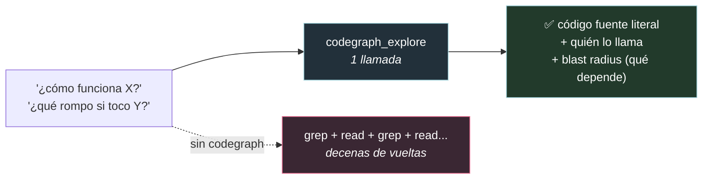
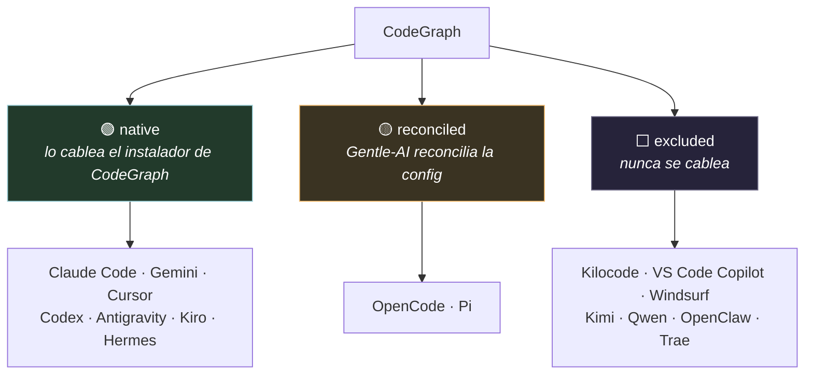

# CodeGraph, explicado para dummies 🕸️

> Qué es CodeGraph, en qué ayuda, cuál es el beneficio, cómo lo integra Gentle-AI
> **para todos los agentes** (no solo Pi), y cómo se usa. Verificado contra
> `internal/components/communitytool/`, `internal/cli/codegraph.go` y las instrucciones
> del server MCP.

> **Aclaración importante:** CodeGraph **NO es solo para gentle-pi**. Es una **herramienta
> de comunidad** que Gentle-AI integra en **muchos agentes** (Claude Code, Cursor, Gemini,
> Codex, OpenCode, Pi, y más). Pi es apenas uno de los casos.

---

## 0. Qué es CodeGraph (en una frase)

> **CodeGraph es un "mapa mental" pre-calculado de tu código: un grafo en SQLite con cada
> símbolo, cada relación y cada archivo del workspace, que el agente consulta en vez de
> andar leyendo archivos a lo loco.**

Es una herramienta **externa** (npm `@colbymchenry/codegraph`, versión fijada `1.4.1`), que
Gentle-AI **instala y cablea** como "community tool" — pero el runtime (indexar, servir) es de
la herramienta, no de Gentle-AI.

**Analogía:** en vez de que el agente recorra la obra pieza por pieza cada vez que le
preguntás algo, CodeGraph es el **plano maestro ya dibujado**: le preguntás "¿quién usa esta
función y qué rompo si la toco?" y te responde al instante, sin re-recorrer todo.

---

## 1. En qué ayuda y cuál es el beneficio

Sin CodeGraph, para entender el código el agente hace **decenas** de `grep` + leer archivos.
Con CodeGraph, hace **una** llamada:

**Los beneficios concretos:**
- **Menos tokens, menos vueltas:** una llamada devuelve el fuente + quién lo llama + el radio
  de impacto. Reemplaza decenas de iteraciones de grep/read.
- **Editás con el impacto a la vista** (blast radius): sabés qué depende de lo que vas a tocar.
- **Inteligencia cacheada:** lecturas sub-milisegundo sobre estructura ya parseada; el índice
  se actualiza solo (~1s) por un file watcher.
- **Ve cosas que grep no ve:** relaciones de dispatch dinámico (callbacks, re-render de React,
  children de JSX) que una búsqueda de texto no sigue.

Por eso la guía que inyecta Gentle-AI lo pone como **regla dura**: *usar CodeGraph antes de
buscar a mano en el filesystem* para preguntas de estructura, arquitectura, flujo de llamadas,
dependencias, referencias de símbolos, análisis de impacto y "cómo funciona X".

---

## 2. Cómo lo integra Gentle-AI (community tool)

Gentle-AI **instala** y **cablea**, no reimplementa el runtime. El flujo (`communitytool/tool.go`):

1. **Snapshot** de todas las rutas que va a tocar (para rollback si algo falla).
2. **Instala el CLI** de CodeGraph: `npm install -g @colbymchenry/codegraph@latest` (o `pnpm add -g ...` si solo hay pnpm).
3. **Cablea los agentes nativos** con el instalador propio de CodeGraph:
   `codegraph install --target <agentes> --location global --yes`.
4. **Reconcilia** OpenCode y Pi (casos especiales), **inyecta la guía** en los prompts, y **valida**.
5. Si al final el CLI `codegraph` no está en el PATH o un agente detectado quedó sin configurar, **el install falla** (con rollback).

> CodeGraph es **la única community tool** hoy. Se engancha en el pipeline de install como un
> paso más cuando lo seleccionás.

---

## 3. Cómo se cablea POR AGENTE (todos)

No todos los agentes se cablean igual. Hay una **tabla de compatibilidad** exhaustiva (los
tests la comparan con el registro, así ningún agente nuevo entra en silencio). Tres estrategias:

| Estrategia | Qué significa | Agentes |
|-----------|---------------|---------|
| **native** | Lo cablea el instalador upstream (`codegraph install --target ...`). | Claude Code, Gemini CLI, Cursor, Codex, Antigravity, Kiro, Hermes |
| **reconciled** | Gentle-AI verifica/reconcilia el cableado él mismo. | OpenCode (verifica el MCP efectivo) y **Pi** (totalmente custom, ver doc 08) |
| **excluded** | Nunca se cablea. | Kilocode, VS Code Copilot, Windsurf, Kimi, Qwen, OpenClaw, Trae |

**La entrada MCP** (igual para todos): clave `codegraph`, comando `codegraph serve --mcp`.

**Dónde se escribe** (según el agente): Claude Code → `~/.claude.json`; Antigravity →
`~/.gemini/config/mcp_config.json`; Kiro → `~/.kiro/settings/mcp.json`; por defecto → el
MCP config + settings del adapter. Para los nativos, esa entrada la escribe el instalador
de CodeGraph; Gentle-AI solo valida que esté.

---

## 4. La guía que Gentle-AI inyecta en los prompts

A todos los agentes de system-prompt compatibles (excepto Pi, que tiene la suya), Gentle-AI
inyecta una sección `## CodeGraph` (con marcador `<!-- gentle-ai:codegraph-guidance -->`). Le dice al agente:

- **Regla de orden dura:** usá CodeGraph **antes** de buscar a mano, para preguntas de estructura/arquitectura/impacto.
- **Preferí el tool `codegraph_explore`**; si el MCP no está, usá los comandos CLI read-only.
- **No proxies** la inteligencia por `gentle-ai codegraph` — ese solo valida el root.
- **Nunca** corras comandos destructivos: `codegraph uninit/install/uninstall/upgrade`; `codegraph index` solo para recuperar un índice corrupto.
- **Orden requerido:** resolver el root (`git rev-parse --show-toplevel`), confirmar que es un proyecto real (nunca en `$HOME` ni temp), chequear `.codegraph/`, y si falta correr `gentle-ai codegraph init` **una vez** (lazy-init).
- **Worktrees:** cada worktree necesita su propio `.codegraph/`; nunca copiar/symlinkear el índice de otro checkout; nunca indexar en `/tmp`.

---

## 5. Cómo se usa en runtime

- **Camino principal — el tool MCP `codegraph_explore`.** Una llamada devuelve el fuente
  literal numerado por archivo + el call path + el blast radius. Es "equivalente a Read" pero
  con contexto de dependencias.
- **Fallback — comandos CLI read-only** (cuando el MCP no está disponible):
  `codegraph status | query | explore | node | files | callers | callees | impact | affected`.
- **El límite `gentle-ai codegraph init`:** un wrapper **seguro** de Gentle-AI, NO un proxy de queries.

> ⚠️ **Dos binarios distintos, no los confundas:**
> - **`gentle-ai codegraph`** = el CLI de Gentle-AI. **Solo** soporta `init --cwd <root>`, para
>   validar el root del proyecto antes de inicializar (resuelve symlinks, exige que sea un git
>   top-level, rechaza `/`, `$HOME` y temp).
> - **`codegraph`** = el binario upstream (instalado por npm/pnpm). Es el dueño real del
>   indexado, del server MCP (`codegraph serve --mcp`), del sync y de todas las queries.

---

## 6. Ciclo de vida (install / sync / uninstall)

- **Install:** sección 2, con rollback por snapshots de las rutas tocadas.
- **Sync:** `gentle-ai sync` refresca la **guía** y reconcilia el cableado (ej.: OpenCode) —
  pero es **conservador**: solo refresca si el CLI está y el agente **ya** tenía CodeGraph.
  O sea, un sync normal **no** te mete CodeGraph si nunca lo activaste. Ojo: este sync de
  **config** es aparte de la frescura del **índice** (que la maneja el watcher / `codegraph sync`).
- **Uninstall:** para Pi, quita solo lo del manifest y preserva/reporta lo que tenga drift.
  Para los nativos, la entrada MCP la escribió el instalador upstream; las secciones de guía
  son markdown gestionado y se remueven con los limpiadores de guía.

---

## 7. Mantenimiento (al día de hoy)

**Activo y bien testeado.** 24 commits recientes en `communitytool/` (último 2026-07-12), casi
todos hardening de CodeGraph (tabla de compatibilidad, reconciliación de OpenCode, worktrees,
estado de Pi). Cobertura fuerte: `tool_test.go` (44 tests), `pi_codegraph_test.go` (36),
`codegraph_contract_test.go` (10, que valida que la tabla matchee el registro de agentes).

---

## Glosario

- **CodeGraph:** herramienta externa; grafo de código en SQLite (símbolos, relaciones, archivos).
- **codegraph_explore:** el tool MCP; una llamada = fuente + callers + blast radius.
- **Blast radius:** qué depende de lo que vas a tocar (radio de impacto).
- **native / reconciled / excluded:** las tres estrategias de cableado por agente.
- **Watcher:** el proceso que mantiene el índice fresco (~1s) tras cada edición.
- **`gentle-ai codegraph init`:** wrapper seguro que valida el root; no hace queries.
- **`.codegraph/`:** el índice local del proyecto (uno por worktree).

---

*Fuentes: `internal/components/communitytool/{tool,codegraph_contract,codegraph_guidance}.go`,
`internal/cli/{codegraph,run,sync}.go`, `internal/model/types.go`, instrucciones del server MCP
de CodeGraph, `docs/components.md`. Verificado contra el código.*
