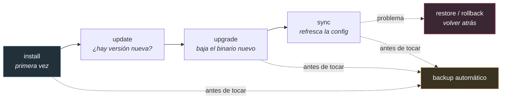
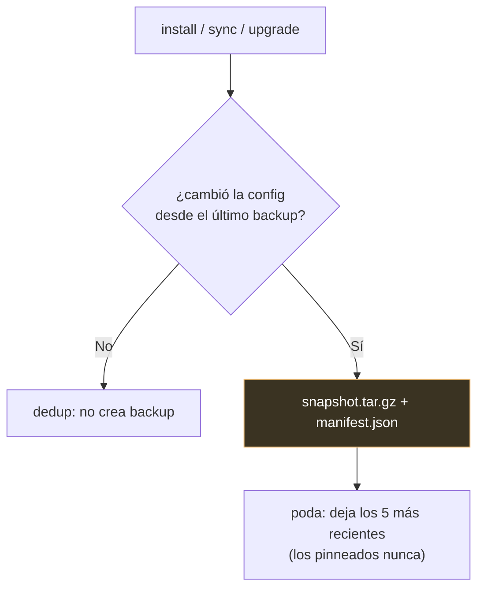

# Operaciones del CLI de Gentle-AI, para dummies 🛠️

> La referencia práctica del día a día: instalar, sincronizar, actualizar, hacer
> rollback, desinstalar y diagnosticar. Verificado contra `docs/usage.md`,
> `docs/rollback.md` e `internal/cli/`.

> Esta es la guía **operativa** (el "cómo lo manejo"). Para entender qué hace cada
> pieza, ver los docs 01–11.

---

## 0. El ciclo de vida típico



**Regla de oro:** antes de cada `install`, `sync` o `upgrade`, el sistema saca un **backup**
automático. Siempre hay camino de vuelta.

---

## 1. `install` — primera vez

Detecta tus herramientas, configura agentes, inyecta componentes. Al instalar **un** agente,
**mergea** en la lista `installed_agents` de `state.json` y **preserva** los `model_assignments`
existentes (no pisa todo el estado).

```bash
# Ecosistema completo para varios agentes
gentle-ai install --agent claude-code,opencode,gemini-cli --preset full-gentleman

# Componentes y skills específicos
gentle-ai install --agent claude-code \
  --component engram,sdd,skills,context7,persona,permissions \
  --skill go-testing,skill-creator --persona gentleman

# Preview sin aplicar nada
gentle-ai install --dry-run --agent claude-code,opencode --preset full-gentleman
```

**Flags clave:** `--agent`, `--component`, `--skill`, `--persona` (gentleman/neutral/custom),
`--preset` (full-gentleman/ecosystem-only/minimal/custom), `--sdd-mode` (single/multi),
`--scope` (global/workspace), `--dry-run`.

> **`--dry-run` es tu amigo:** siempre previsualizá el plan antes de aplicar.

---

## 2. `sync` — refrescar la config

Alinea los assets gestionados a la versión actual del binario. Se usa **después de un upgrade**
o cuando querés que tus configs queden al día. **NO** reinstala binarios (engram, GGA) — solo
actualiza prompts, skills, MCP y orquestadores SDD.

```bash
gentle-ai sync --dry-run                    # preview del scope
gentle-ai sync                              # sincroniza los agentes de state.json
gentle-ai sync --agent claude-code --agent opencode   # solo esos
```

**Puntos importantes:**
- Es **idempotente**: correrlo dos veces no cambia nada la segunda vez (`FilesChanged == 0`).
- Usa la selección guardada en `~/.gentle-ai/state.json` (no toca agentes que no elegiste gestionar).
- No acepta `--component`; para los opt-in usá `--include-permissions` y `--include-theme`.
- Soporta perfiles SDD de OpenCode: `--profile name:provider/model`,
  `--profile-phase name:phase:provider/model`, `--sdd-profile-strategy`.

---

## 3. `update` / `upgrade` — actualizar el propio gentle-ai

```bash
gentle-ai update    # ¿hay versión nueva?
gentle-ai upgrade   # baja el binario nuevo y reemplaza el actual
```

**Después de un upgrade, corré `gentle-ai sync`** para refrescar los assets a la versión nueva.

**Comportamiento del self-update:**
| Situación | Qué hace |
|-----------|----------|
| Terminal interactiva | Pregunta `Apply now? [Y/n]` (Enter acepta). |
| No-TTY (CI/pipe) | Auto-declina, nunca se cuelga. |
| `GENTLE_AI_YES=1` | Auto-acepta (para scripts). |
| `GENTLE_AI_NO_SELF_UPDATE=1` | Saltea el chequeo. |

> Si GitHub te limita los chequeos, exportá `GITHUB_TOKEN` o `GH_TOKEN`.

---

## 4. Backup & Restore & Rollback — la red de seguridad

El sistema **snapshotea automáticamente** antes de cada install/sync/upgrade. Los backups son
comprimidos, deduplicados y podados solos.



**Restaurar:**
```bash
gentle-ai restore latest        # restaura el snapshot más reciente
gentle-ai restore <id> --yes    # restaura uno específico sin confirmar
```

O desde la TUI (pantalla **Backups**): `Enter` restaura, `p` pin/unpin (protege de la poda),
`r` renombra, `d` borra.

**Cómo restaura:**
- Si el archivo existía antes → lo vuelve a ese estado.
- Si NO existía (lo creó el install) → lo elimina (revierte la creación).
- Es atómico por archivo.

> ⚠️ **Qué NO cubre el rollback:** paquetes instalados con `brew`/`apt`/`pacman` **no** se
> desinstalan. El sistema de snapshots maneja **solo archivos de configuración**. Para
> deshacer un paquete usá tu package manager (`brew uninstall`, etc.).

**Retención:** 5 más recientes sin pinnear; los pinneados sobreviven siempre; duplicados se saltean.

---

## 5. `uninstall` — sacar la config gestionada

Quita **solo** lo que gentle-ai gestiona (secciones de prompt, MCP, skills/config). **No**
desinstala binarios ni paquetes externos. Hace backup antes.

```bash
gentle-ai uninstall --agent claude-code --agent opencode          # agentes específicos
gentle-ai uninstall --agent claude-code --component sdd,persona    # solo esos componentes
gentle-ai uninstall --all                                         # de todos los agentes
gentle-ai uninstall --agent cursor --component skills --yes        # sin confirmar
```

Sin `--component`, saca todos los componentes gestionados del agente elegido.

---

## 6. `doctor` — diagnóstico (read-only)

```bash
gentle-ai doctor
```

No cambia nada. Chequea: binarios en `PATH` (+ detección de shadow), validez de `state.json`,
alcanzabilidad del MCP de Engram, y espacio en disco. Cada check da **pass/warn/fail** con una
pista de remedio. **Corré `doctor` primero cuando algo sale raro.**

---

## 7. `skill-registry refresh` — el índice de skills

```bash
gentle-ai skill-registry refresh
gentle-ai skill-registry refresh --force
gentle-ai skill-registry refresh --cwd /path --quiet
```

Escanea skills del proyecto primero (`skills/`, `.claude/skills/`, etc.) y después las globales;
las del proyecto ganan. Escribe `.atl/skill-registry.md` (+ cache). Codex, Claude Code y OpenCode
lo cablean en hooks de startup; Pi lo hace vía gentle-pi.

---

## 8. Otros comandos útiles

| Comando | Qué hace |
|---------|----------|
| `gentle-ai version` (`-v`, `--version`) | Muestra la versión. |
| `gentle-ai sdd-status [change]` | Estado estructurado del SDD (read-only). |
| `gentle-ai sdd-continue [change]` | Corre la próxima fase SDD lista. |
| `gentle-ai review <start\|finalize\|validate\|...>` | El sistema de review (ver doc 03). |
| `gentle-ai codegraph init` | Valida el root del proyecto para CodeGraph (ver doc 11). |

---

## 9. Variables de entorno útiles

| Variable | Para qué |
|----------|----------|
| `GENTLE_AI_YES=1` | Auto-acepta el self-update (scripts). Scopealo a una sola invocación. |
| `GENTLE_AI_NO_SELF_UPDATE=1` | Saltea el chequeo de update. |
| `GENTLE_AI_INSTALL_SCOPE` | Equivale a `--scope` (global/workspace) para CI. |
| `GITHUB_TOKEN` / `GH_TOKEN` | Evita el rate-limit de GitHub en update/upgrade. |

---

## 10. Workflow típico

```bash
# Primera vez
brew install gentleman-programming/tap/gentle-ai
gentle-ai install --agent claude-code,cursor --preset full-gentleman

# Tras una release nueva
brew upgrade gentle-ai   # (o gentle-ai upgrade)
gentle-ai sync

# Agregar un agente después
gentle-ai install --agent windsurf --preset full-gentleman

# Si algo salió mal
gentle-ai doctor
gentle-ai restore latest
```

**Regla de oro del troubleshooting:** `doctor` primero (para ver qué está roto), después
`restore latest` si necesitás volver atrás, y `--dry-run` para validar el plan antes de reintentar.

---

## Glosario

- **Preset:** combo predefinido de componentes (full-gentleman/ecosystem-only/minimal/custom).
- **Scope:** dónde escribe (`global` = config del agente; `workspace` = el proyecto actual).
- **Idempotente:** correrlo N veces = correrlo 1 vez.
- **Snapshot:** foto comprimida de tu config antes de una operación.
- **Pin:** marcar un backup para que la poda no lo borre.
- **state.json:** `~/.gentle-ai/state.json`, guarda qué agentes gestionás.
- **Shadow (binario):** cuando otro binario del mismo nombre resuelve primero en el PATH.

---

*Fuentes: `docs/usage.md`, `docs/rollback.md`, `docs/non-interactive.md`, `internal/cli/`.
Verificado contra las docs y el código.*
